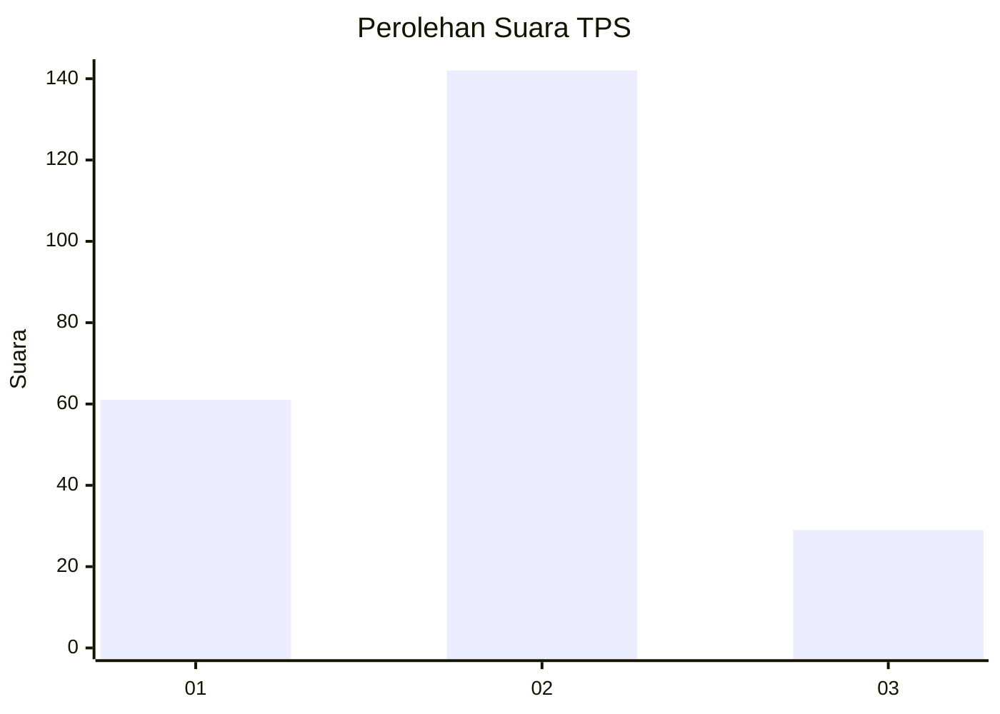
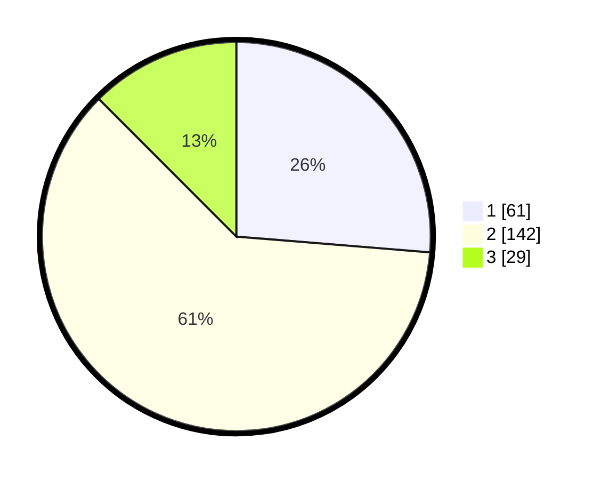

# Hasil

## Grafik

## Tabel

| No. | Nama Paslon    | Suara | Suara (raw) | Persentase |
|:--- |:-------------- | -----:| -----------:| ----------:|
| 1   | ANIES MUHAIMIN | 61    | [61][p-1]   | 26,29      |
| 2   | PRABOWO GIBRAN | 142   | [142][p-2]  | 61,21      |
| 3   | GANJAR MAHFUD  | 29    | [29][p-3]   | 12,50      |

[p-1]: https://github.com/gigit-pemilu/pemilu-2024-36-banten/blob/main/pilpres/hitung-suara/sub/36-banten/sub/74-kota-tangerang-selatan/sub/02-serpong-utara/sub/1001-pakulonan/sub/002-tps/sub/paslon-1.txt
[p-2]: https://github.com/gigit-pemilu/pemilu-2024-36-banten/blob/main/pilpres/hitung-suara/sub/36-banten/sub/74-kota-tangerang-selatan/sub/02-serpong-utara/sub/1001-pakulonan/sub/002-tps/sub/paslon-2.txt
[p-3]: https://github.com/gigit-pemilu/pemilu-2024-36-banten/blob/main/pilpres/hitung-suara/sub/36-banten/sub/74-kota-tangerang-selatan/sub/02-serpong-utara/sub/1001-pakulonan/sub/002-tps/sub/paslon-3.txt

## Foto C Plano

https://sirekap-obj-formc.kpu.go.id/e24d/pemilu/ppwp/36/74/02/10/01/3674021001002-20240214-202251--3f5fd526-2205-4d0f-81a5-51b810f103b1.jpg

https://sirekap-obj-formc.kpu.go.id/e24d/pemilu/ppwp/36/74/02/10/01/3674021001002-20240214-202347--75826020-9b1b-4c2e-9658-b962e3b0b479.jpg

https://sirekap-obj-formc.kpu.go.id/e24d/pemilu/ppwp/36/74/02/10/01/3674021001002-20240214-202448--f8047b34-c3e2-417d-8cd5-f9e1e2466fde.jpg

## Metadata

| Key        | Value               |
| ---------- | ------------------- |
| Time Stamp | 2024-02-15 15:30:25 |

