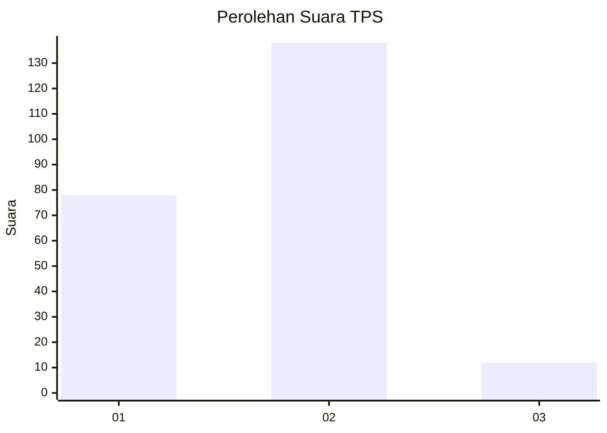
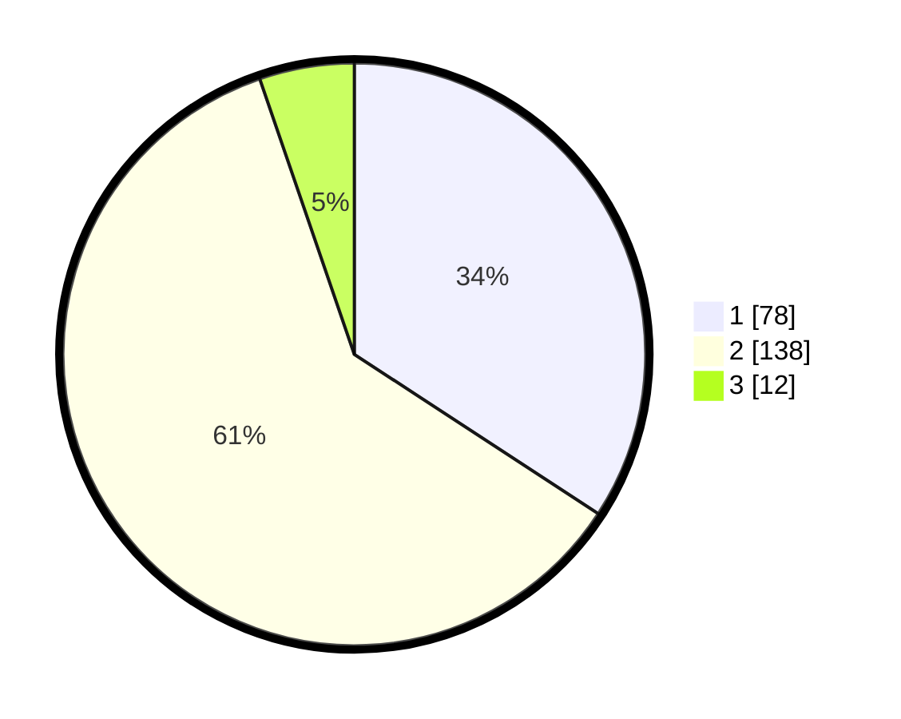

# Hasil

## Grafik

## Tabel

| No. | Nama Paslon    | Suara | Suara (raw) | Persentase |
|:--- |:-------------- | -----:| -----------:| ----------:|
| 1   | ANIES MUHAIMIN | 78    | [78][p-1]   | 34,21      |
| 2   | PRABOWO GIBRAN | 138   | [138][p-2]  | 60,53      |
| 3   | GANJAR MAHFUD  | 12    | [12][p-3]   | 5,26       |

[p-1]: https://github.com/gigit-pemilu/pemilu-2024/blob/main/pilpres/hitung-suara/sub/36-banten/sub/74-kota-tangerang-selatan/sub/02-serpong-utara/sub/1001-pakulonan/sub/003-tps/sub/paslon-1.txt
[p-2]: https://github.com/gigit-pemilu/pemilu-2024/blob/main/pilpres/hitung-suara/sub/36-banten/sub/74-kota-tangerang-selatan/sub/02-serpong-utara/sub/1001-pakulonan/sub/003-tps/sub/paslon-2.txt
[p-3]: https://github.com/gigit-pemilu/pemilu-2024/blob/main/pilpres/hitung-suara/sub/36-banten/sub/74-kota-tangerang-selatan/sub/02-serpong-utara/sub/1001-pakulonan/sub/003-tps/sub/paslon-3.txt

## Foto C Plano

https://sirekap-obj-formc.kpu.go.id/e909/pemilu/ppwp/36/74/02/10/01/3674021001003-20240214-220005--7bd29e6a-5a78-4f7d-a86b-2f019a9465c1.jpg

https://sirekap-obj-formc.kpu.go.id/e909/pemilu/ppwp/36/74/02/10/01/3674021001003-20240214-220209--ab306b63-1c65-45cb-a472-6a78afd5a3cb.jpg

https://sirekap-obj-formc.kpu.go.id/e909/pemilu/ppwp/36/74/02/10/01/3674021001003-20240214-220358--d6afe001-6e38-4b51-8e4b-87d4f83db24d.jpg

## Metadata

| Key        | Value               |
| ---------- | ------------------- |
| Time Stamp | 2024-02-16 16:25:10 |

