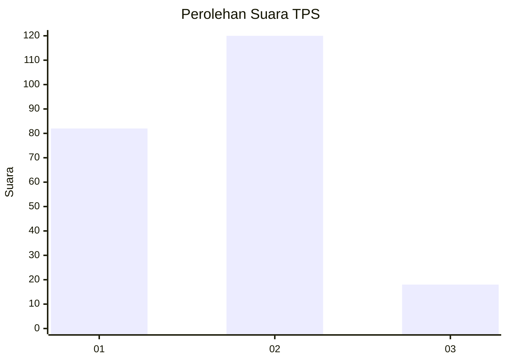

# Hasil

## Grafik

## Tabel

| No. | Nama Paslon    | Suara | Suara (raw) | Persentase |
|:--- |:-------------- | -----:| -----------:| ----------:|
| 1   | ANIES MUHAIMIN | 82    | [82][p-1]   | 37,27      |
| 2   | PRABOWO GIBRAN | 120   | [120][p-2]  | 54,55      |
| 3   | GANJAR MAHFUD  | 18    | [18][p-3]   | 8,18       |

[p-1]: https://github.com/gigit-pemilu/pemilu-2024/blob/main/pilpres/hitung-suara/sub/36-banten/sub/74-kota-tangerang-selatan/sub/02-serpong-utara/sub/1002-pakualam/sub/002-tps/sub/paslon-1.txt
[p-2]: https://github.com/gigit-pemilu/pemilu-2024/blob/main/pilpres/hitung-suara/sub/36-banten/sub/74-kota-tangerang-selatan/sub/02-serpong-utara/sub/1002-pakualam/sub/002-tps/sub/paslon-2.txt
[p-3]: https://github.com/gigit-pemilu/pemilu-2024/blob/main/pilpres/hitung-suara/sub/36-banten/sub/74-kota-tangerang-selatan/sub/02-serpong-utara/sub/1002-pakualam/sub/002-tps/sub/paslon-3.txt

## Foto C Plano

https://sirekap-obj-formc.kpu.go.id/fbd2/pemilu/ppwp/36/74/02/10/02/3674021002002-20240217-094351--1362ab64-6fbb-4cbb-b9a3-169ea92b7a68.jpg

https://sirekap-obj-formc.kpu.go.id/fbd2/pemilu/ppwp/36/74/02/10/02/3674021002002-20240217-094624--44e97960-0459-48cc-8c4e-5464bf8d756b.jpg

https://sirekap-obj-formc.kpu.go.id/fbd2/pemilu/ppwp/36/74/02/10/02/3674021002002-20240217-094715--d4d76c4b-c6a6-4025-a5c4-ba8a239f4bb7.jpg

## Metadata

| Key        | Value               |
| ---------- | ------------------- |
| Time Stamp | 2024-02-17 17:30:00 |

## DATA PEMILIH TETAP

Jumlah pemilih dalam DPT: **232**.
 * L: **140**.
 * P: **452**.

## DATA PENGGUNA HAK PILIH

Jumlah pengguna hak pilih dalam DPT: **293**.
 * L: **114**.
 * P: **147**.

Jumlah pengguna hak pilih dalam DPTb: **38**.
 * L: **882**.
 * P: **608**.

Jumlah pengguna hak pilih dalam DPK: **888**.
 * L: **88**.
 * P: **808**.

Jumlah pengguna hak pilih: **221**.
 * L: **202**.
 * P: **609**.

## JUMLAH SUARA SAH DAN TIDAK SAH

JUMLAH SELURUH SUARA SAH: **220**.

JUMLAH SUARA TIDAK SAH: **1**.

JUMLAH SELURUH SUARA SAH DAN SUARA TIDAK SAH: **221**.

