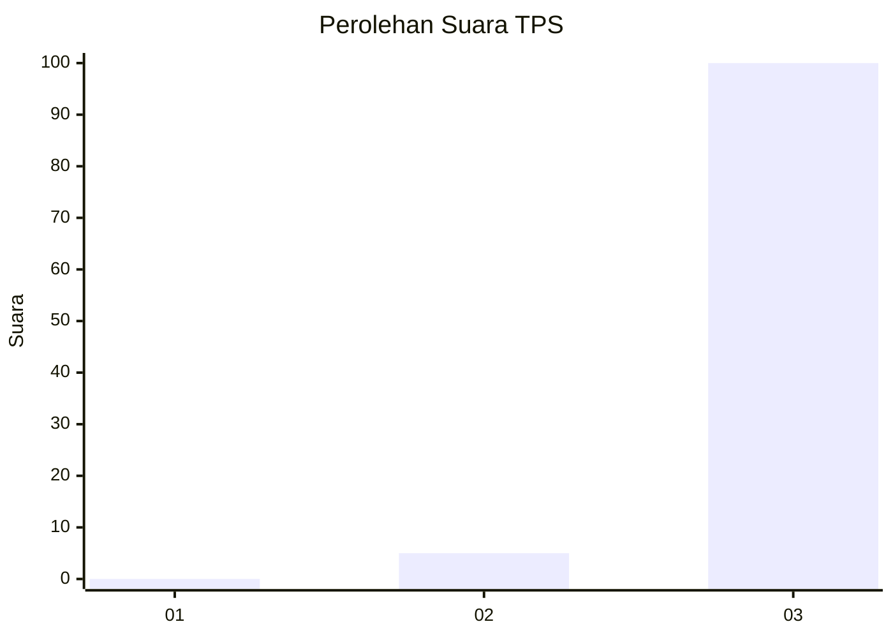
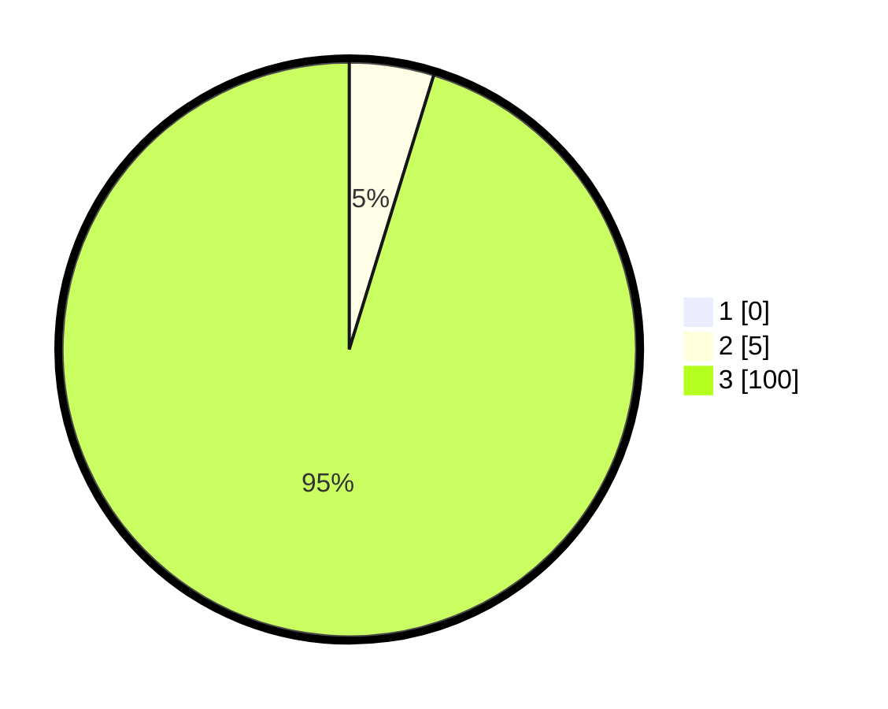

# Hasil

## Grafik

## Tabel

| No. | Nama Paslon    | Suara | Suara (raw) | Persentase |
|:--- |:-------------- | -----:| -----------:| ----------:|
| 1   | ANIES MUHAIMIN | 0     | [0][p-1]    | 0,00       |
| 2   | PRABOWO GIBRAN | 5     | [5][p-2]    | 4,76       |
| 3   | GANJAR MAHFUD  | 100   | [100][p-3]  | 95,24      |

[p-1]: https://github.com/gigit-pemilu/pemilu-2024-36-banten/blob/main/pilpres/hitung-suara/sub/36-banten/sub/74-kota-tangerang-selatan/sub/02-serpong-utara/sub/1002-pakualam/sub/010-tps/sub/paslon-1.txt
[p-2]: https://github.com/gigit-pemilu/pemilu-2024-36-banten/blob/main/pilpres/hitung-suara/sub/36-banten/sub/74-kota-tangerang-selatan/sub/02-serpong-utara/sub/1002-pakualam/sub/010-tps/sub/paslon-2.txt
[p-3]: https://github.com/gigit-pemilu/pemilu-2024-36-banten/blob/main/pilpres/hitung-suara/sub/36-banten/sub/74-kota-tangerang-selatan/sub/02-serpong-utara/sub/1002-pakualam/sub/010-tps/sub/paslon-3.txt

## Foto C Plano

https://sirekap-obj-formc.kpu.go.id/c3f8/pemilu/ppwp/36/74/02/10/02/3674021002010-20240217-172112--2fbaff78-15fb-4f85-8a32-c38293f29fbc.jpg

https://sirekap-obj-formc.kpu.go.id/c3f8/pemilu/ppwp/36/74/02/10/02/3674021002010-20240217-172153--cdfcf610-18bd-4fa3-bc8e-79b15a9a9e62.jpg

https://sirekap-obj-formc.kpu.go.id/c3f8/pemilu/ppwp/36/74/02/10/02/3674021002010-20240217-172235--dda5db94-7859-4a68-8175-8dd45f0c709f.jpg

## Metadata

| Key        | Value               |
| ---------- | ------------------- |
| Time Stamp | 2024-02-17 17:30:00 |

