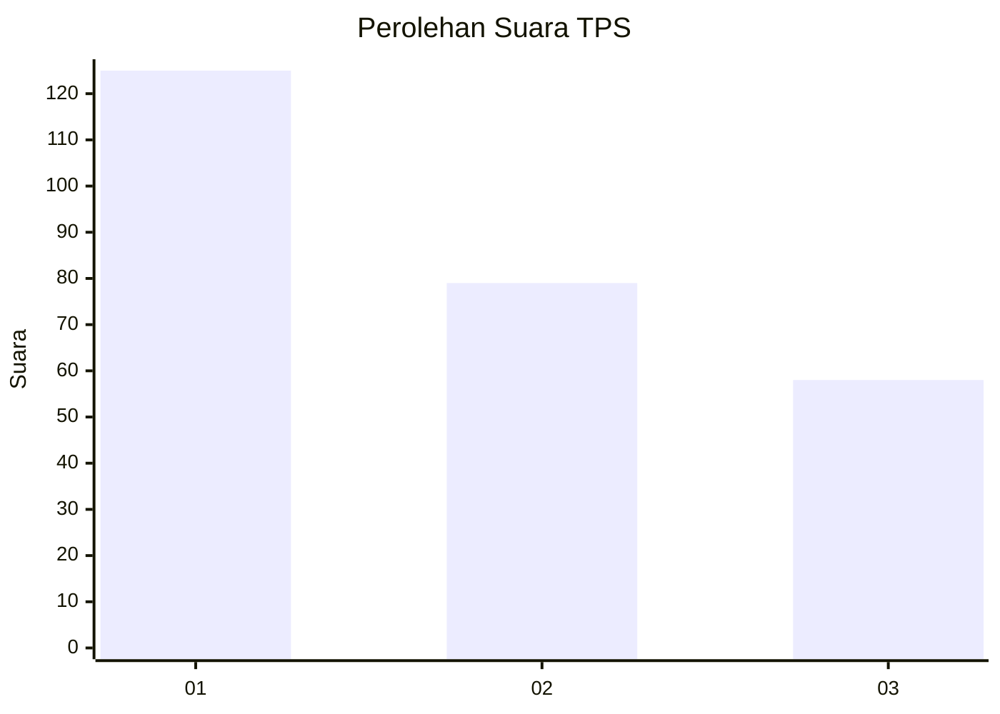
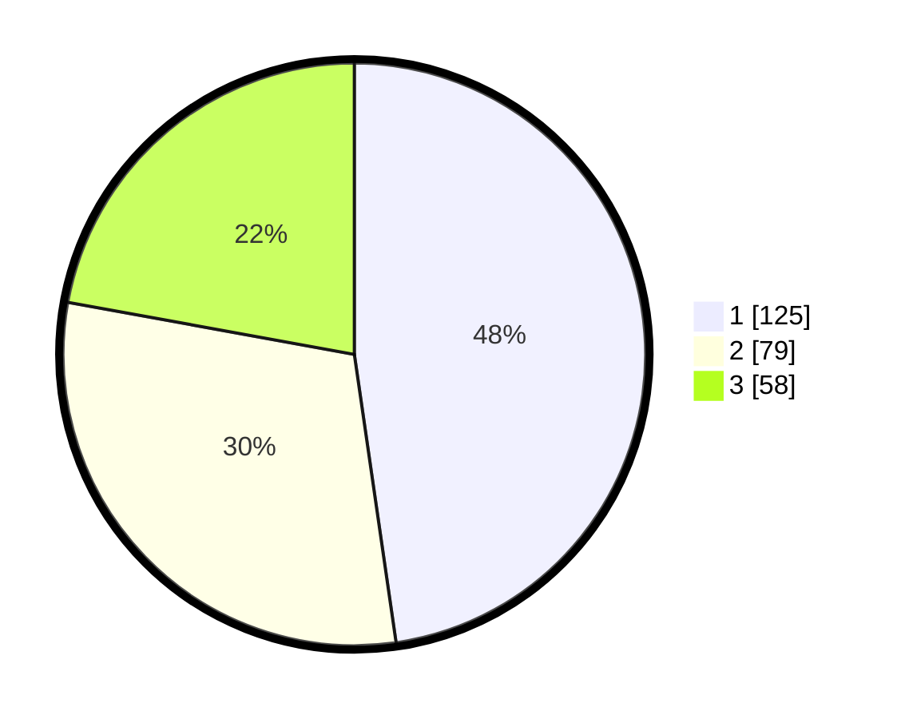

# Hasil

## Grafik

## Tabel

| No. | Nama Paslon    | Suara | Suara (raw) | Persentase |
|:--- |:-------------- | -----:| -----------:| ----------:|
| 1   | ANIES MUHAIMIN | 125   | [125][p-1]  | 47,71      |
| 2   | PRABOWO GIBRAN | 79    | [79][p-2]   | 30,15      |
| 3   | GANJAR MAHFUD  | 58    | [58][p-3]   | 22,14      |

[p-1]: https://github.com/gigit-pemilu/pemilu-2024-36-banten/blob/main/pilpres/hitung-suara/sub/36-banten/sub/74-kota-tangerang-selatan/sub/02-serpong-utara/sub/1005-pondok-jagung-timur/sub/012-tps/sub/paslon-1.txt
[p-2]: https://github.com/gigit-pemilu/pemilu-2024-36-banten/blob/main/pilpres/hitung-suara/sub/36-banten/sub/74-kota-tangerang-selatan/sub/02-serpong-utara/sub/1005-pondok-jagung-timur/sub/012-tps/sub/paslon-2.txt
[p-3]: https://github.com/gigit-pemilu/pemilu-2024-36-banten/blob/main/pilpres/hitung-suara/sub/36-banten/sub/74-kota-tangerang-selatan/sub/02-serpong-utara/sub/1005-pondok-jagung-timur/sub/012-tps/sub/paslon-3.txt

## Foto C Plano

https://sirekap-obj-formc.kpu.go.id/abb9/pemilu/ppwp/36/74/02/10/05/3674021005012-20240214-195030--bd75960d-91b7-4c69-82a4-c9d6ff5d9bc8.jpg

https://sirekap-obj-formc.kpu.go.id/abb9/pemilu/ppwp/36/74/02/10/05/3674021005012-20240214-195204--19ba7b76-3bf3-4b5d-b5be-24f71e8177ad.jpg

https://sirekap-obj-formc.kpu.go.id/abb9/pemilu/ppwp/36/74/02/10/05/3674021005012-20240214-195249--8fcce9ff-f3ac-43a1-86fd-c23bec5c8f34.jpg

## Metadata

| Key        | Value               |
| ---------- | ------------------- |
| Time Stamp | 2024-02-19 06:16:00 |

