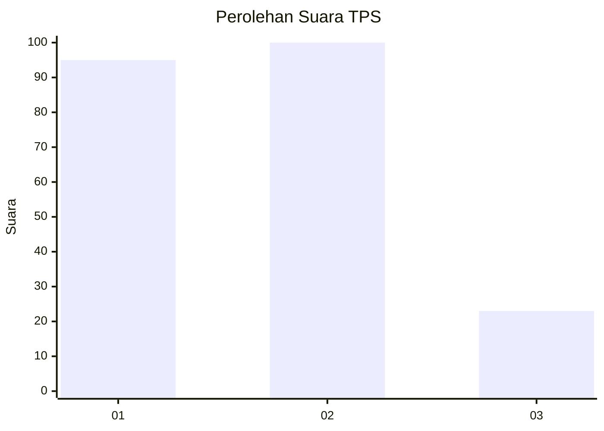
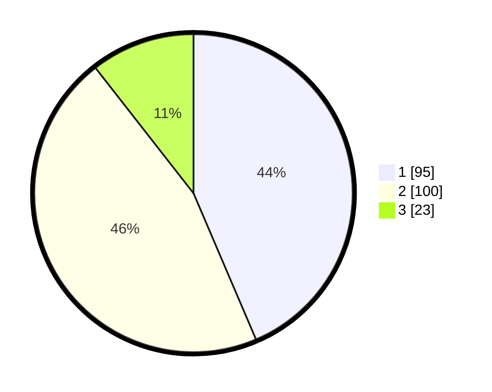

# Hasil

## Grafik

## Tabel

| No. | Nama Paslon    | Suara | Suara (raw) | Persentase |
|:--- |:-------------- | -----:| -----------:| ----------:|
| 1   | ANIES MUHAIMIN | 95    | [95][p-1]   | 43,58      |
| 2   | PRABOWO GIBRAN | 100   | [100][p-2]  | 45,87      |
| 3   | GANJAR MAHFUD  | 23    | [23][p-3]   | 10,55      |

[p-1]: https://github.com/gigit-pemilu/pemilu-2024-36-banten/blob/main/pilpres/hitung-suara/sub/36-banten/sub/74-kota-tangerang-selatan/sub/03-pondok-aren/sub/1001-pondok-betung/sub/001-tps/sub/paslon-1.txt
[p-2]: https://github.com/gigit-pemilu/pemilu-2024-36-banten/blob/main/pilpres/hitung-suara/sub/36-banten/sub/74-kota-tangerang-selatan/sub/03-pondok-aren/sub/1001-pondok-betung/sub/001-tps/sub/paslon-2.txt
[p-3]: https://github.com/gigit-pemilu/pemilu-2024-36-banten/blob/main/pilpres/hitung-suara/sub/36-banten/sub/74-kota-tangerang-selatan/sub/03-pondok-aren/sub/1001-pondok-betung/sub/001-tps/sub/paslon-3.txt

## Foto C Plano

https://sirekap-obj-formc.kpu.go.id/0c1a/pemilu/ppwp/36/74/03/10/01/3674031001001-20240217-214633--4b6997f6-ed70-4003-abed-282130e512fa.jpg

https://sirekap-obj-formc.kpu.go.id/0c1a/pemilu/ppwp/36/74/03/10/01/3674031001001-20240217-214721--bd0429c3-2222-47e8-9a1b-c43b1899f67f.jpg

https://sirekap-obj-formc.kpu.go.id/0c1a/pemilu/ppwp/36/74/03/10/01/3674031001001-20240217-214817--61c11292-c9fd-4a9f-b265-bb5a01493a13.jpg

## Metadata

| Key        | Value               |
| ---------- | ------------------- |
| Time Stamp | 2024-02-24 22:31:28 |

