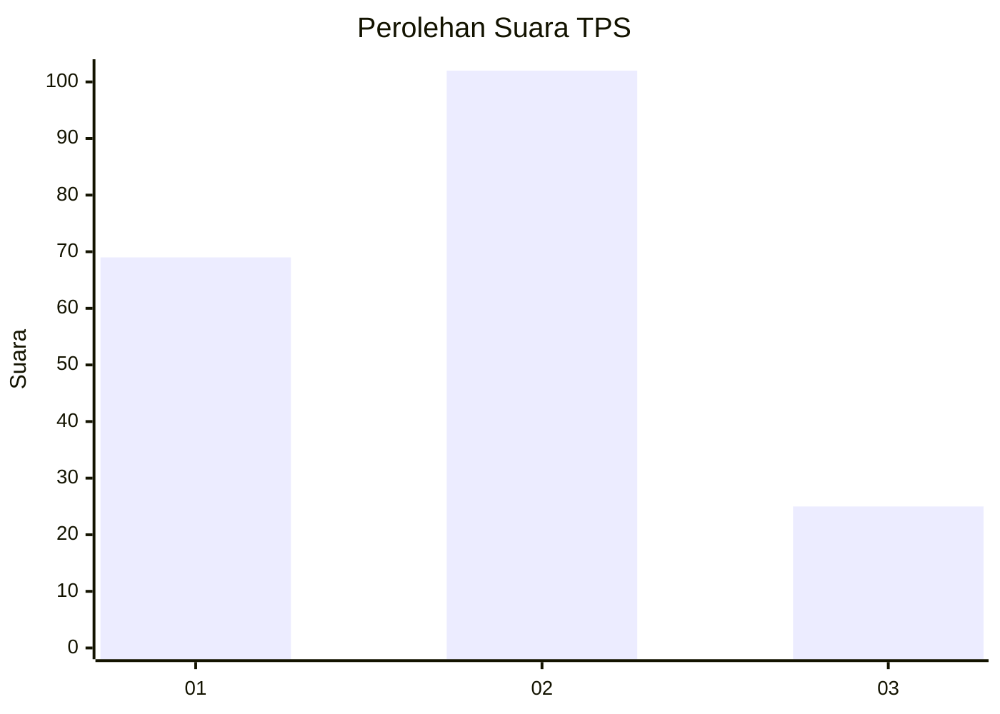
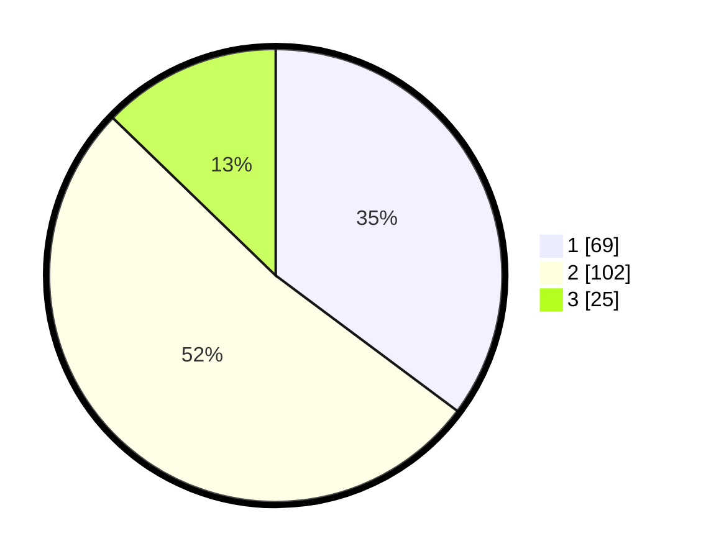

# Hasil

## Grafik

## Tabel

| No. | Nama Paslon    | Suara | Suara (raw) | Persentase |
|:--- |:-------------- | -----:| -----------:| ----------:|
| 1   | ANIES MUHAIMIN | 69    | [69][p-1]   | 35,20      |
| 2   | PRABOWO GIBRAN | 102   | [102][p-2]  | 52,04      |
| 3   | GANJAR MAHFUD  | 25    | [25][p-3]   | 12,76      |

[p-1]: https://github.com/gigit-pemilu/pemilu-2024-36-banten/blob/main/pilpres/hitung-suara/sub/36-banten/sub/74-kota-tangerang-selatan/sub/03-pondok-aren/sub/1001-pondok-betung/sub/008-tps/sub/paslon-1.txt
[p-2]: https://github.com/gigit-pemilu/pemilu-2024-36-banten/blob/main/pilpres/hitung-suara/sub/36-banten/sub/74-kota-tangerang-selatan/sub/03-pondok-aren/sub/1001-pondok-betung/sub/008-tps/sub/paslon-2.txt
[p-3]: https://github.com/gigit-pemilu/pemilu-2024-36-banten/blob/main/pilpres/hitung-suara/sub/36-banten/sub/74-kota-tangerang-selatan/sub/03-pondok-aren/sub/1001-pondok-betung/sub/008-tps/sub/paslon-3.txt

## Foto C Plano

https://sirekap-obj-formc.kpu.go.id/f363/pemilu/ppwp/36/74/03/10/01/3674031001008-20240215-004329--b693cea0-5e33-438a-a080-7456032009b6.jpg

https://sirekap-obj-formc.kpu.go.id/f363/pemilu/ppwp/36/74/03/10/01/3674031001008-20240215-004410--3854ea0e-37c1-4b98-b48f-5a7f60ca20ff.jpg

https://sirekap-obj-formc.kpu.go.id/f363/pemilu/ppwp/36/74/03/10/01/3674031001008-20240215-004503--6ee90083-124e-4bce-8564-133f4b69686f.jpg

## Metadata

| Key        | Value               |
| ---------- | ------------------- |
| Time Stamp | 2024-02-24 22:31:28 |

