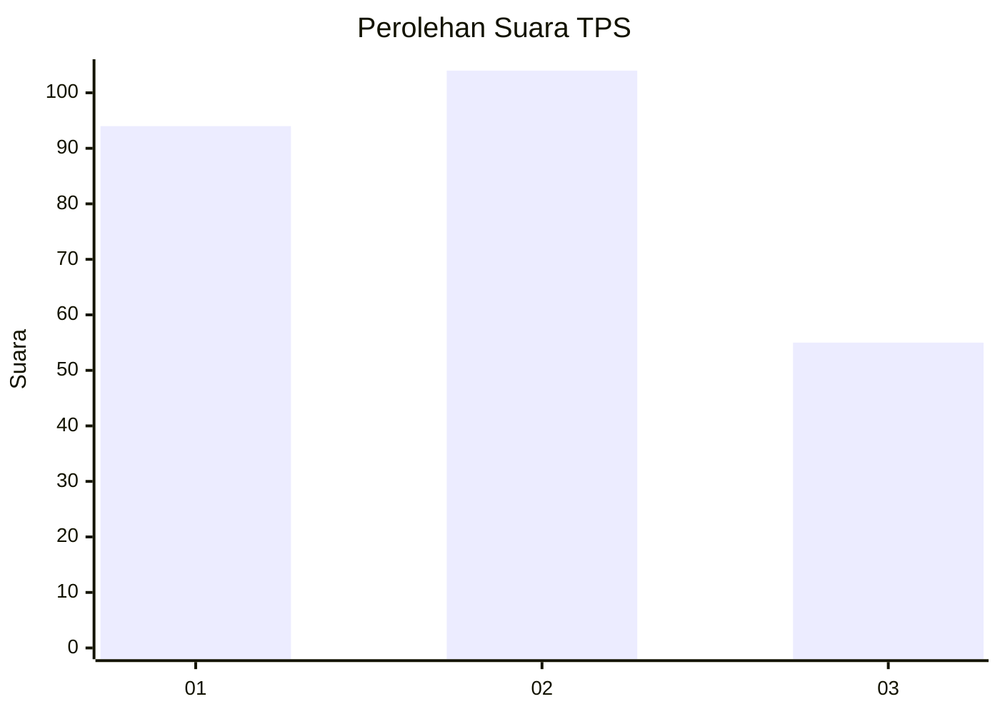
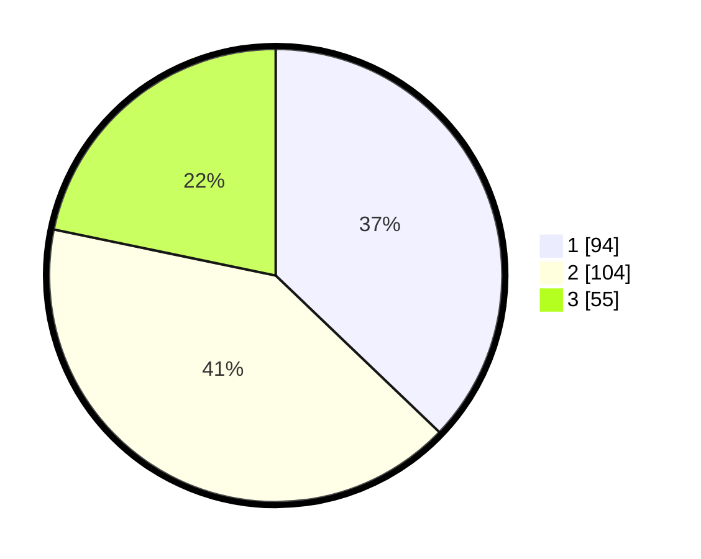

# Hasil

## Grafik

## Tabel

| No. | Nama Paslon    | Suara | Suara (raw) | Persentase |
|:--- |:-------------- | -----:| -----------:| ----------:|
| 1   | ANIES MUHAIMIN | 94    | [94][p-1]   | 37,15      |
| 2   | PRABOWO GIBRAN | 104   | [104][p-2]  | 41,11      |
| 3   | GANJAR MAHFUD  | 55    | [55][p-3]   | 21,74      |

[p-1]: https://github.com/gigit-pemilu/pemilu-2024-36-banten/blob/main/pilpres/hitung-suara/sub/36-banten/sub/74-kota-tangerang-selatan/sub/03-pondok-aren/sub/1002-pondok-pucung/sub/016-tps/sub/paslon-1.txt
[p-2]: https://github.com/gigit-pemilu/pemilu-2024-36-banten/blob/main/pilpres/hitung-suara/sub/36-banten/sub/74-kota-tangerang-selatan/sub/03-pondok-aren/sub/1002-pondok-pucung/sub/016-tps/sub/paslon-2.txt
[p-3]: https://github.com/gigit-pemilu/pemilu-2024-36-banten/blob/main/pilpres/hitung-suara/sub/36-banten/sub/74-kota-tangerang-selatan/sub/03-pondok-aren/sub/1002-pondok-pucung/sub/016-tps/sub/paslon-3.txt

## Foto C Plano

https://sirekap-obj-formc.kpu.go.id/ed5e/pemilu/ppwp/36/74/03/10/02/3674031002016-20240215-042036--e4ae7040-adf6-488b-9c1b-83039d7eb1fe.jpg

https://sirekap-obj-formc.kpu.go.id/ed5e/pemilu/ppwp/36/74/03/10/02/3674031002016-20240215-042127--b4f785cc-851d-4e33-b227-c13ea8b2a30e.jpg

https://sirekap-obj-formc.kpu.go.id/ed5e/pemilu/ppwp/36/74/03/10/02/3674031002016-20240215-011537--3ddb737f-8a14-4cb4-af82-ace2012baece.jpg

## Metadata

| Key        | Value               |
| ---------- | ------------------- |
| Time Stamp | 2024-02-24 22:31:28 |

