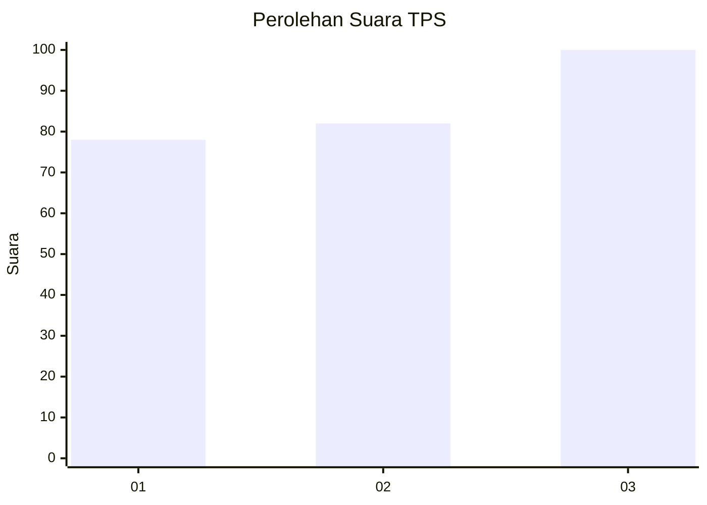
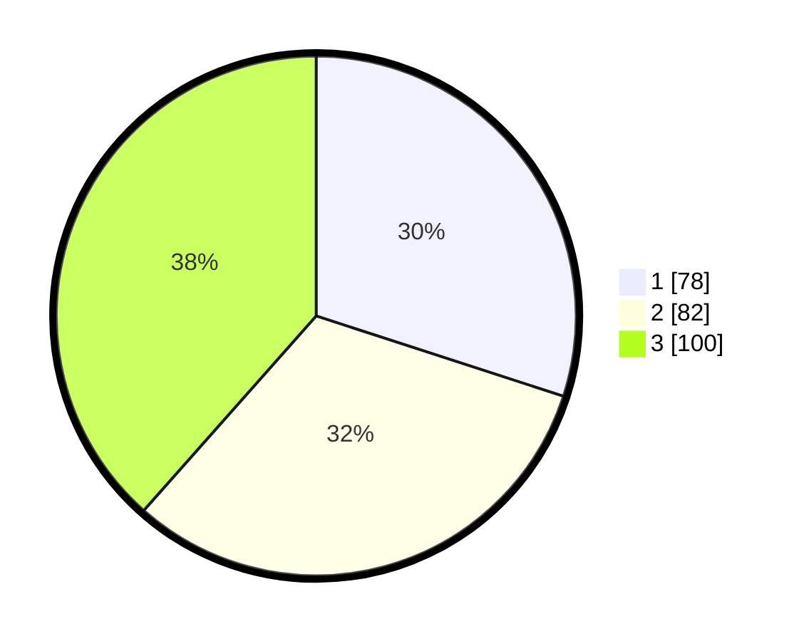

# Hasil

## Grafik

## Tabel

| No. | Nama Paslon    | Suara | Suara (raw) | Persentase |
|:--- |:-------------- | -----:| -----------:| ----------:|
| 1   | ANIES MUHAIMIN | 78    | [78][p-1]   | 30,00      |
| 2   | PRABOWO GIBRAN | 82    | [82][p-2]   | 31,54      |
| 3   | GANJAR MAHFUD  | 100   | [100][p-3]  | 38,46      |

[p-1]: https://github.com/gigit-pemilu/pemilu-2024/blob/main/pilpres/hitung-suara/sub/36-banten/sub/74-kota-tangerang-selatan/sub/03-pondok-aren/sub/1002-pondok-pucung/sub/048-tps/sub/paslon-1.txt
[p-2]: https://github.com/gigit-pemilu/pemilu-2024/blob/main/pilpres/hitung-suara/sub/36-banten/sub/74-kota-tangerang-selatan/sub/03-pondok-aren/sub/1002-pondok-pucung/sub/048-tps/sub/paslon-2.txt
[p-3]: https://github.com/gigit-pemilu/pemilu-2024/blob/main/pilpres/hitung-suara/sub/36-banten/sub/74-kota-tangerang-selatan/sub/03-pondok-aren/sub/1002-pondok-pucung/sub/048-tps/sub/paslon-3.txt

## Foto C Plano

https://sirekap-obj-formc.kpu.go.id/7dd2/pemilu/ppwp/36/74/03/10/02/3674031002048-20240215-044859--1ecc1ddc-e352-4087-9cce-d6d22175e798.jpg

https://sirekap-obj-formc.kpu.go.id/7dd2/pemilu/ppwp/36/74/03/10/02/3674031002048-20240215-045228--a699822e-0f62-4f9b-b8b8-ababcf3826b4.jpg

https://sirekap-obj-formc.kpu.go.id/7dd2/pemilu/ppwp/36/74/03/10/02/3674031002048-20240215-045747--dad66bd2-6381-45e9-a957-f2c2c34676d8.jpg

## Metadata

| Key        | Value               |
| ---------- | ------------------- |
| Time Stamp | 2024-02-26 10:00:00 |

