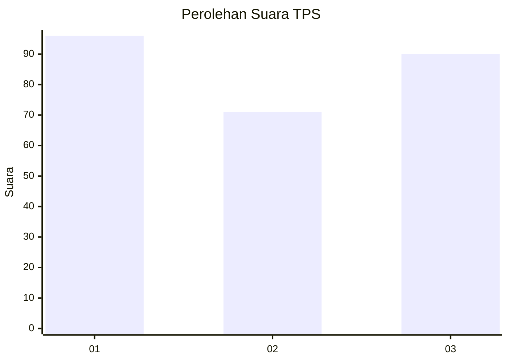
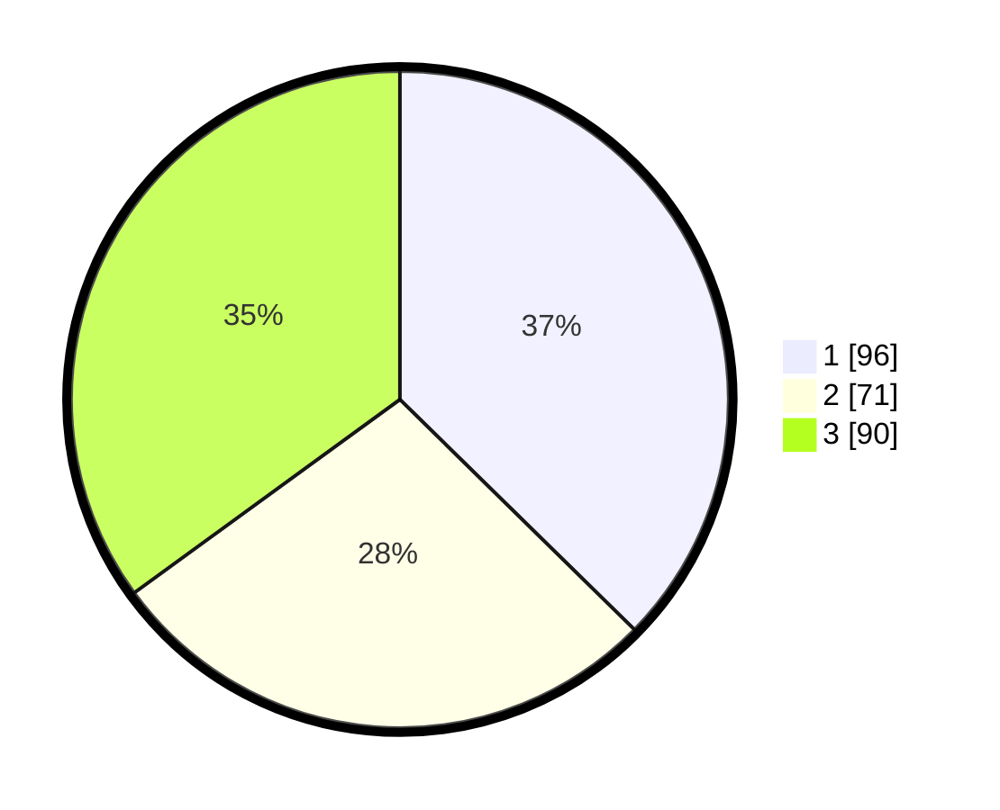

# Hasil

## Grafik

## Tabel

| No. | Nama Paslon    | Suara | Suara (raw) | Persentase |
|:--- |:-------------- | -----:| -----------:| ----------:|
| 1   | ANIES MUHAIMIN | 96    | [96][p-1]   | 37,35      |
| 2   | PRABOWO GIBRAN | 71    | [71][p-2]   | 27,63      |
| 3   | GANJAR MAHFUD  | 90    | [90][p-3]   | 35,02      |

[p-1]: https://github.com/gigit-pemilu/pemilu-2024/blob/main/pilpres/hitung-suara/sub/36-banten/sub/74-kota-tangerang-selatan/sub/03-pondok-aren/sub/1002-pondok-pucung/sub/052-tps/sub/paslon-1.txt
[p-2]: https://github.com/gigit-pemilu/pemilu-2024/blob/main/pilpres/hitung-suara/sub/36-banten/sub/74-kota-tangerang-selatan/sub/03-pondok-aren/sub/1002-pondok-pucung/sub/052-tps/sub/paslon-2.txt
[p-3]: https://github.com/gigit-pemilu/pemilu-2024/blob/main/pilpres/hitung-suara/sub/36-banten/sub/74-kota-tangerang-selatan/sub/03-pondok-aren/sub/1002-pondok-pucung/sub/052-tps/sub/paslon-3.txt

## Foto C Plano

https://sirekap-obj-formc.kpu.go.id/a74a/pemilu/ppwp/36/74/03/10/02/3674031002052-20240215-013408--9c18588e-d9c0-46be-a0b4-b85953cbeb76.jpg

https://sirekap-obj-formc.kpu.go.id/a74a/pemilu/ppwp/36/74/03/10/02/3674031002052-20240215-013507--516c48d8-5220-4fe6-a851-807ff874fee9.jpg

https://sirekap-obj-formc.kpu.go.id/a74a/pemilu/ppwp/36/74/03/10/02/3674031002052-20240215-013537--1e145f0c-0142-4557-8645-adb67ab654d0.jpg

## Metadata

| Key        | Value               |
| ---------- | ------------------- |
| Time Stamp | 2024-02-24 22:31:28 |

