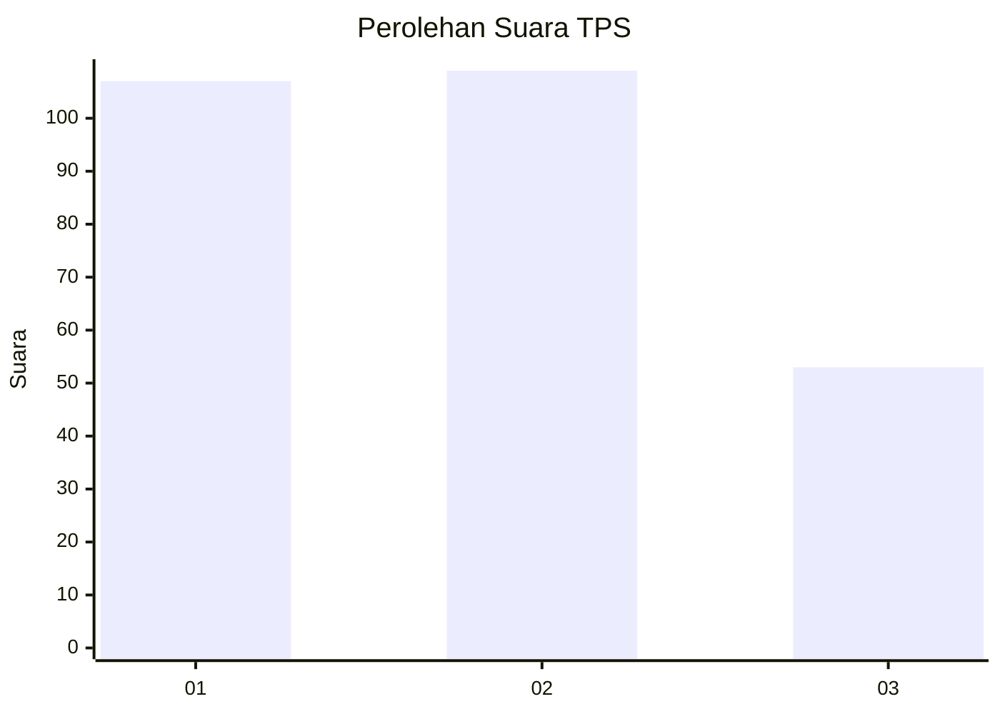
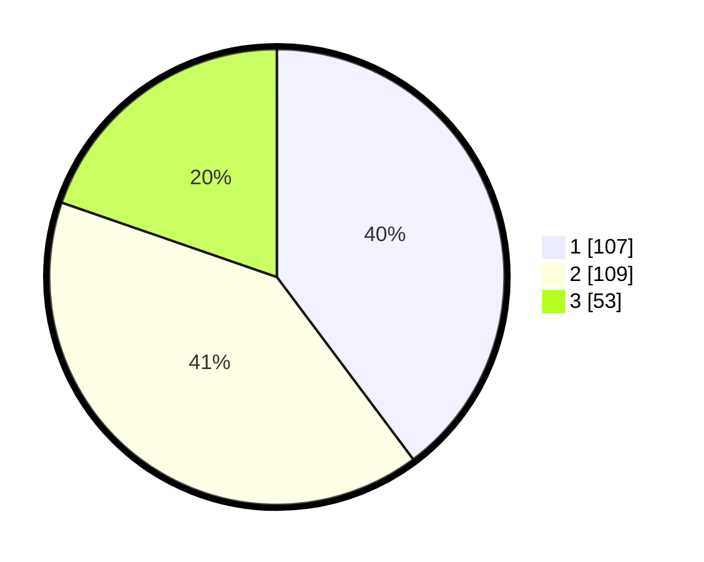

# Hasil

## Grafik

## Tabel

| No. | Nama Paslon    | Suara | Suara (raw) | Persentase |
|:--- |:-------------- | -----:| -----------:| ----------:|
| 1   | ANIES MUHAIMIN | 107   | [107][p-1]  | 39,78      |
| 2   | PRABOWO GIBRAN | 109   | [109][p-2]  | 40,52      |
| 3   | GANJAR MAHFUD  | 53    | [53][p-3]   | 19,70      |

[p-1]: https://github.com/gigit-pemilu/pemilu-2024-36-banten/blob/main/pilpres/hitung-suara/sub/36-banten/sub/74-kota-tangerang-selatan/sub/03-pondok-aren/sub/1005-pondok-aren/sub/017-tps/sub/paslon-1.txt
[p-2]: https://github.com/gigit-pemilu/pemilu-2024-36-banten/blob/main/pilpres/hitung-suara/sub/36-banten/sub/74-kota-tangerang-selatan/sub/03-pondok-aren/sub/1005-pondok-aren/sub/017-tps/sub/paslon-2.txt
[p-3]: https://github.com/gigit-pemilu/pemilu-2024-36-banten/blob/main/pilpres/hitung-suara/sub/36-banten/sub/74-kota-tangerang-selatan/sub/03-pondok-aren/sub/1005-pondok-aren/sub/017-tps/sub/paslon-3.txt

## Foto C Plano

https://sirekap-obj-formc.kpu.go.id/6e79/pemilu/ppwp/36/74/03/10/05/3674031005017-20240215-020255--c7aeff0e-1903-4c2d-bf1e-a87d96760a7c.jpg

https://sirekap-obj-formc.kpu.go.id/6e79/pemilu/ppwp/36/74/03/10/05/3674031005017-20240215-020453--2f74ac24-e26d-45ec-9d8d-44b5768c91c5.jpg

https://sirekap-obj-formc.kpu.go.id/6e79/pemilu/ppwp/36/74/03/10/05/3674031005017-20240215-020619--1dba1b9a-363f-4dfc-8275-6abd6d455166.jpg

## Metadata

| Key        | Value               |
| ---------- | ------------------- |
| Time Stamp | 2024-02-24 22:31:28 |

