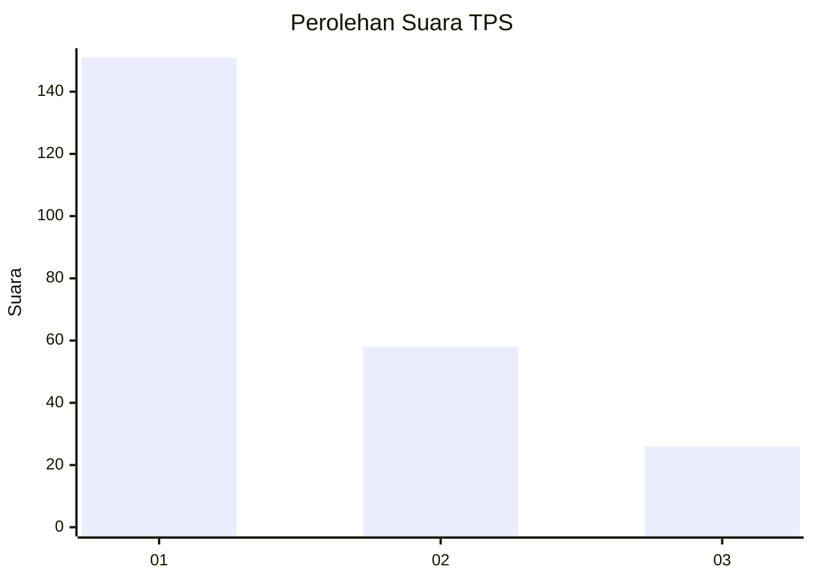
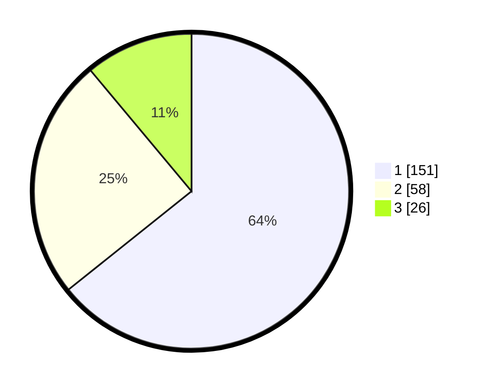

# Hasil

## Grafik

## Tabel

| No. | Nama Paslon    | Suara | Suara (raw) | Persentase |
|:--- |:-------------- | -----:| -----------:| ----------:|
| 1   | ANIES MUHAIMIN | 151   | [151][p-1]  | 64,26      |
| 2   | PRABOWO GIBRAN | 58    | [58][p-2]   | 24,68      |
| 3   | GANJAR MAHFUD  | 26    | [26][p-3]   | 11,06      |

[p-1]: https://github.com/gigit-pemilu/pemilu-2024/blob/main/pilpres/hitung-suara/sub/36-banten/sub/74-kota-tangerang-selatan/sub/03-pondok-aren/sub/1010-jurangmangu-barat/sub/044-tps/sub/paslon-1.txt
[p-2]: https://github.com/gigit-pemilu/pemilu-2024/blob/main/pilpres/hitung-suara/sub/36-banten/sub/74-kota-tangerang-selatan/sub/03-pondok-aren/sub/1010-jurangmangu-barat/sub/044-tps/sub/paslon-2.txt
[p-3]: https://github.com/gigit-pemilu/pemilu-2024/blob/main/pilpres/hitung-suara/sub/36-banten/sub/74-kota-tangerang-selatan/sub/03-pondok-aren/sub/1010-jurangmangu-barat/sub/044-tps/sub/paslon-3.txt

## Foto C Plano

https://sirekap-obj-formc.kpu.go.id/aea0/pemilu/ppwp/36/74/03/10/10/3674031010044-20240214-230046--5615c5f2-f164-4f17-ad3b-ba644ed94b19.jpg

https://sirekap-obj-formc.kpu.go.id/aea0/pemilu/ppwp/36/74/03/10/10/3674031010044-20240214-230158--864e03b2-e173-45a1-bf80-d0a7d62402b6.jpg

https://sirekap-obj-formc.kpu.go.id/aea0/pemilu/ppwp/36/74/03/10/10/3674031010044-20240214-230334--212c8ad3-28fc-4e6e-9351-6db74224a93a.jpg

## Metadata

| Key        | Value               |
| ---------- | ------------------- |
| Time Stamp | 2024-02-25 13:00:00 |

