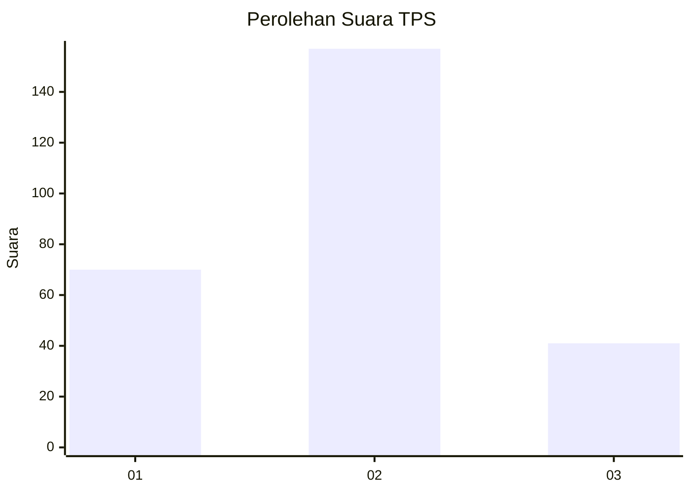

# Hasil

## Grafik

## Tabel

| No. | Nama Paslon    | Suara | Suara (raw) | Persentase |
|:--- |:-------------- | -----:| -----------:| ----------:|
| 1   | ANIES MUHAIMIN | 70    | [70][p-1]   | 26,12      |
| 2   | PRABOWO GIBRAN | 157   | [157][p-2]  | 58,58      |
| 3   | GANJAR MAHFUD  | 41    | [41][p-3]   | 15,30      |

[p-1]: https://github.com/gigit-pemilu/pemilu-2024-36-banten/blob/main/pilpres/hitung-suara/sub/36-banten/sub/74-kota-tangerang-selatan/sub/04-ciputat/sub/1004-sawah/sub/036-tps/sub/paslon-1.txt
[p-2]: https://github.com/gigit-pemilu/pemilu-2024-36-banten/blob/main/pilpres/hitung-suara/sub/36-banten/sub/74-kota-tangerang-selatan/sub/04-ciputat/sub/1004-sawah/sub/036-tps/sub/paslon-2.txt
[p-3]: https://github.com/gigit-pemilu/pemilu-2024-36-banten/blob/main/pilpres/hitung-suara/sub/36-banten/sub/74-kota-tangerang-selatan/sub/04-ciputat/sub/1004-sawah/sub/036-tps/sub/paslon-3.txt

## Foto C Plano

https://sirekap-obj-formc.kpu.go.id/0b4a/pemilu/ppwp/36/74/04/10/04/3674041004036-20240214-224718--d85ca224-b5d4-4553-82b4-e215a9e3935b.jpg

https://sirekap-obj-formc.kpu.go.id/0b4a/pemilu/ppwp/36/74/04/10/04/3674041004036-20240214-204408--fd9370f0-dc01-4e37-ab10-a1124a9913fb.jpg

https://sirekap-obj-formc.kpu.go.id/0b4a/pemilu/ppwp/36/74/04/10/04/3674041004036-20240214-204411--e1881930-e2a1-4ad4-a215-3af19f3413f4.jpg

## Metadata

| Key        | Value               |
| ---------- | ------------------- |
| Time Stamp | 2024-02-15 00:41:44 |

