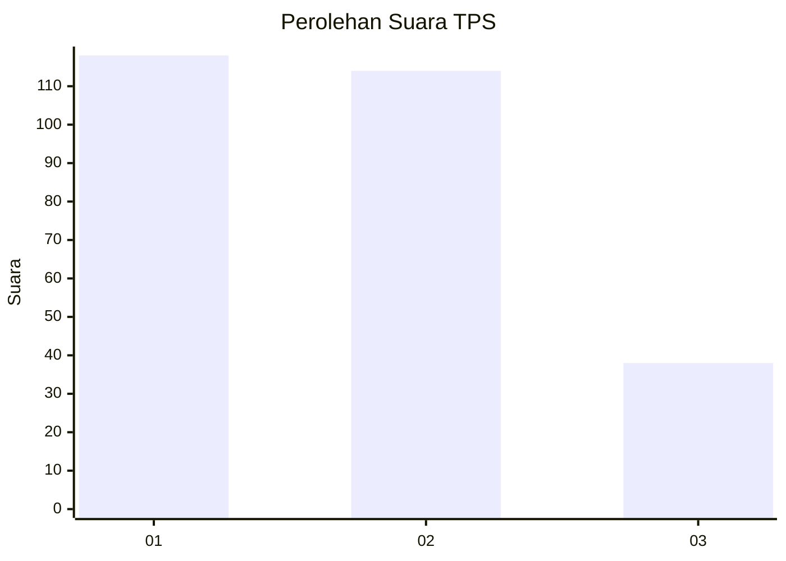
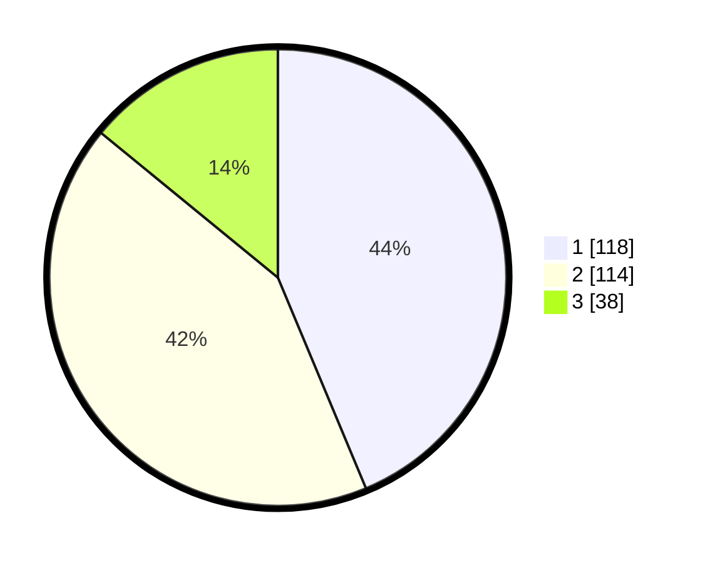

# Hasil

## Grafik

## Tabel

| No. | Nama Paslon    | Suara | Suara (raw) | Persentase |
|:--- |:-------------- | -----:| -----------:| ----------:|
| 1   | ANIES MUHAIMIN | 118   | [118][p-1]  | 43,70      |
| 2   | PRABOWO GIBRAN | 114   | [114][p-2]  | 42,22      |
| 3   | GANJAR MAHFUD  | 38    | [38][p-3]   | 14,07      |

[p-1]: https://github.com/gigit-pemilu/pemilu-2024-36-banten/blob/main/pilpres/hitung-suara/sub/36-banten/sub/74-kota-tangerang-selatan/sub/05-ciputat-timur/sub/1003-pisangan/sub/002-tps/sub/paslon-1.txt
[p-2]: https://github.com/gigit-pemilu/pemilu-2024-36-banten/blob/main/pilpres/hitung-suara/sub/36-banten/sub/74-kota-tangerang-selatan/sub/05-ciputat-timur/sub/1003-pisangan/sub/002-tps/sub/paslon-2.txt
[p-3]: https://github.com/gigit-pemilu/pemilu-2024-36-banten/blob/main/pilpres/hitung-suara/sub/36-banten/sub/74-kota-tangerang-selatan/sub/05-ciputat-timur/sub/1003-pisangan/sub/002-tps/sub/paslon-3.txt

## Foto C Plano

https://sirekap-obj-formc.kpu.go.id/c1ae/pemilu/ppwp/36/74/05/10/03/3674051003002-20240217-112913--08b4e153-490a-46c0-bee2-9f1aaf96891b.jpg

https://sirekap-obj-formc.kpu.go.id/c1ae/pemilu/ppwp/36/74/05/10/03/3674051003002-20240217-113008--c5c7aa04-55dc-42ef-8181-2c3ffd50caff.jpg

https://sirekap-obj-formc.kpu.go.id/c1ae/pemilu/ppwp/36/74/05/10/03/3674051003002-20240217-113228--0d60babb-f26c-44e2-bc80-a48cb8f49aea.jpg

## Metadata

| Key        | Value               |
| ---------- | ------------------- |
| Time Stamp | 2024-02-17 19:30:00 |

