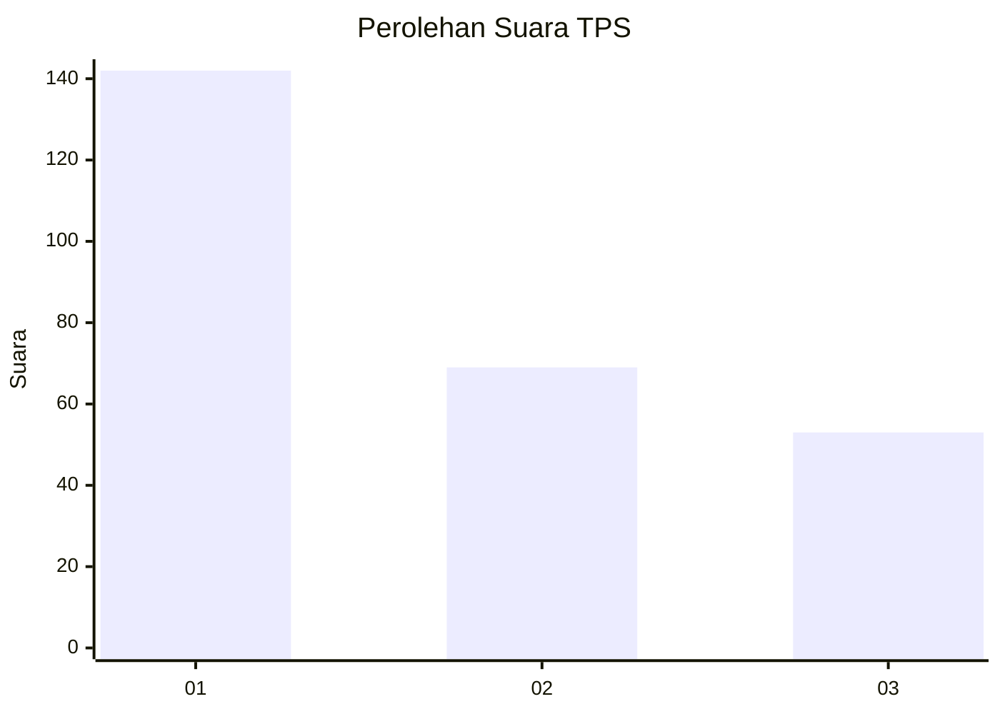
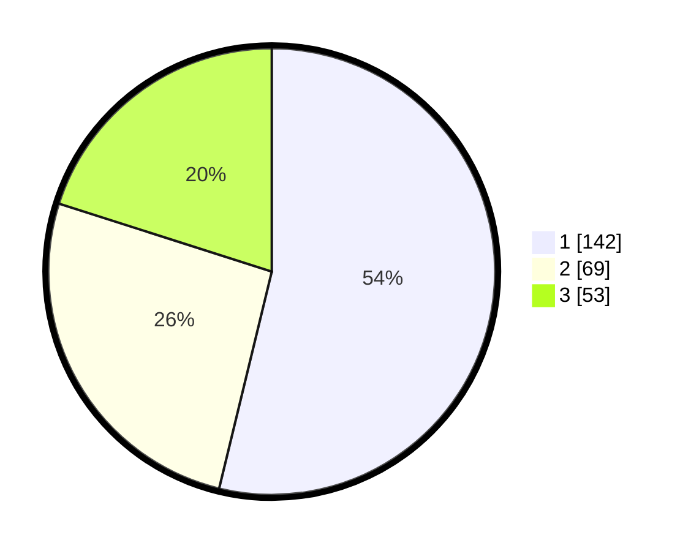

# Hasil

## Grafik

## Tabel

| No. | Nama Paslon    | Suara | Suara (raw) | Persentase |
|:--- |:-------------- | -----:| -----------:| ----------:|
| 1   | ANIES MUHAIMIN | 142   | [142][p-1]  | 53,79      |
| 2   | PRABOWO GIBRAN | 69    | [69][p-2]   | 26,14      |
| 3   | GANJAR MAHFUD  | 53    | [53][p-3]   | 20,08      |

[p-1]: https://github.com/gigit-pemilu/pemilu-2024/blob/main/pilpres/hitung-suara/sub/36-banten/sub/74-kota-tangerang-selatan/sub/05-ciputat-timur/sub/1003-pisangan/sub/089-tps/sub/paslon-1.txt
[p-2]: https://github.com/gigit-pemilu/pemilu-2024/blob/main/pilpres/hitung-suara/sub/36-banten/sub/74-kota-tangerang-selatan/sub/05-ciputat-timur/sub/1003-pisangan/sub/089-tps/sub/paslon-2.txt
[p-3]: https://github.com/gigit-pemilu/pemilu-2024/blob/main/pilpres/hitung-suara/sub/36-banten/sub/74-kota-tangerang-selatan/sub/05-ciputat-timur/sub/1003-pisangan/sub/089-tps/sub/paslon-3.txt

## Foto C Plano

https://sirekap-obj-formc.kpu.go.id/9fff/pemilu/ppwp/36/74/05/10/03/3674051003089-20240215-024806--032e4f5d-ac3a-4834-9413-2733498c215d.jpg

https://sirekap-obj-formc.kpu.go.id/9fff/pemilu/ppwp/36/74/05/10/03/3674051003089-20240215-024813--3f9d4899-65af-4dbe-8ac2-1dc61cdcf395.jpg

https://sirekap-obj-formc.kpu.go.id/9fff/pemilu/ppwp/36/74/05/10/03/3674051003089-20240215-024820--c6265f9d-172a-4e06-a711-f7c7bc7bde88.jpg

## Metadata

| Key        | Value               |
| ---------- | ------------------- |
| Time Stamp | 2024-02-17 19:30:00 |

