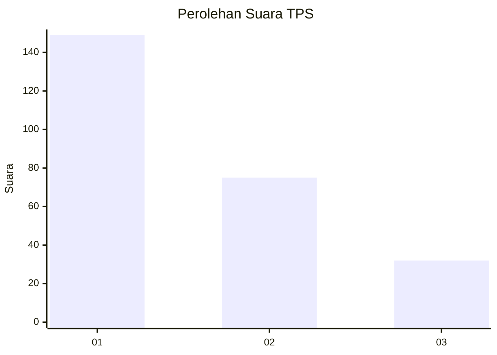
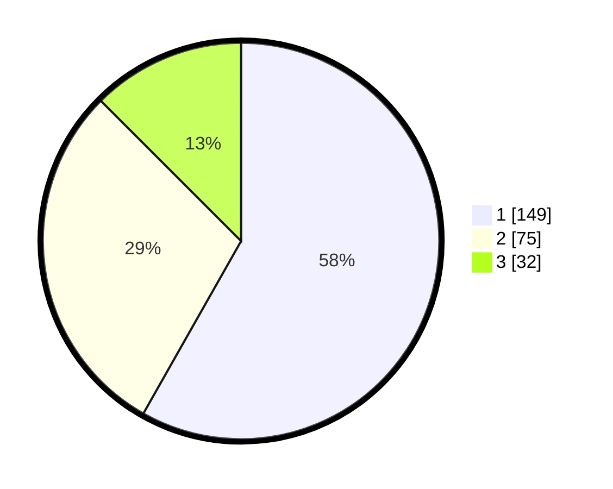

# Hasil

## Grafik

## Tabel

| No. | Nama Paslon    | Suara | Suara (raw) | Persentase |
|:--- |:-------------- | -----:| -----------:| ----------:|
| 1   | ANIES MUHAIMIN | 149   | [149][p-1]  | 58,20      |
| 2   | PRABOWO GIBRAN | 75    | [75][p-2]   | 29,30      |
| 3   | GANJAR MAHFUD  | 32    | [32][p-3]   | 12,50      |

[p-1]: https://github.com/gigit-pemilu/pemilu-2024/blob/main/pilpres/hitung-suara/sub/36-banten/sub/74-kota-tangerang-selatan/sub/05-ciputat-timur/sub/1004-cireundeu/sub/015-tps/sub/paslon-1.txt
[p-2]: https://github.com/gigit-pemilu/pemilu-2024/blob/main/pilpres/hitung-suara/sub/36-banten/sub/74-kota-tangerang-selatan/sub/05-ciputat-timur/sub/1004-cireundeu/sub/015-tps/sub/paslon-2.txt
[p-3]: https://github.com/gigit-pemilu/pemilu-2024/blob/main/pilpres/hitung-suara/sub/36-banten/sub/74-kota-tangerang-selatan/sub/05-ciputat-timur/sub/1004-cireundeu/sub/015-tps/sub/paslon-3.txt

## Foto C Plano

https://sirekap-obj-formc.kpu.go.id/26d2/pemilu/ppwp/36/74/05/10/04/3674051004015-20240217-203743--468bccb1-22a5-4566-a526-80c8dde7641c.jpg

https://sirekap-obj-formc.kpu.go.id/26d2/pemilu/ppwp/36/74/05/10/04/3674051004015-20240217-203822--772609c4-eecf-4483-b7de-59588ce4382a.jpg

https://sirekap-obj-formc.kpu.go.id/26d2/pemilu/ppwp/36/74/05/10/04/3674051004015-20240217-203911--39e650c4-cc65-4dc3-a1fb-0beec6f6d6e2.jpg

## Metadata

| Key        | Value               |
| ---------- | ------------------- |
| Time Stamp | 2024-02-22 12:00:00 |

