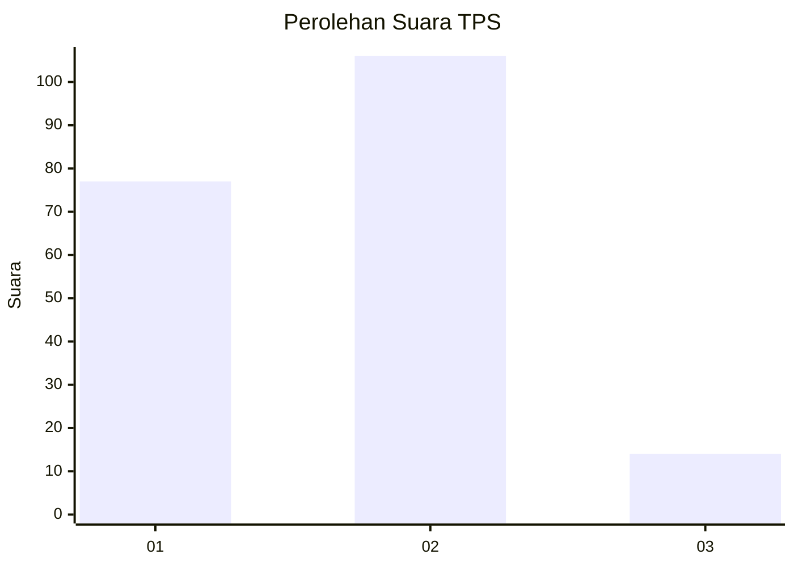

# Hasil

## Grafik

## Tabel

| No. | Nama Paslon    | Suara | Suara (raw) | Persentase |
|:--- |:-------------- | -----:| -----------:| ----------:|
| 1   | ANIES MUHAIMIN | 77    | [77][p-1]   | 39,09      |
| 2   | PRABOWO GIBRAN | 106   | [106][p-2]  | 53,81      |
| 3   | GANJAR MAHFUD  | 14    | [14][p-3]   | 7,11       |

[p-1]: https://github.com/gigit-pemilu/pemilu-2024-36-banten/blob/main/pilpres/hitung-suara/sub/36-banten/sub/74-kota-tangerang-selatan/sub/06-pamulang/sub/1001-pamulang-barat/sub/007-tps/sub/paslon-1.txt
[p-2]: https://github.com/gigit-pemilu/pemilu-2024-36-banten/blob/main/pilpres/hitung-suara/sub/36-banten/sub/74-kota-tangerang-selatan/sub/06-pamulang/sub/1001-pamulang-barat/sub/007-tps/sub/paslon-2.txt
[p-3]: https://github.com/gigit-pemilu/pemilu-2024-36-banten/blob/main/pilpres/hitung-suara/sub/36-banten/sub/74-kota-tangerang-selatan/sub/06-pamulang/sub/1001-pamulang-barat/sub/007-tps/sub/paslon-3.txt

## Foto C Plano

https://sirekap-obj-formc.kpu.go.id/d97a/pemilu/ppwp/36/74/06/10/01/3674061001007-20240214-193023--24d13d66-b25c-412d-907f-3fbac50efe71.jpg

https://sirekap-obj-formc.kpu.go.id/d97a/pemilu/ppwp/36/74/06/10/01/3674061001007-20240214-193055--f4417e85-a8f8-4b56-bef9-c4d5ab78476e.jpg

https://sirekap-obj-formc.kpu.go.id/d97a/pemilu/ppwp/36/74/06/10/01/3674061001007-20240214-193125--eaffb0b1-512f-4807-a5f7-c17934de66f7.jpg

## Metadata

| Key        | Value               |
| ---------- | ------------------- |
| Time Stamp | 2024-02-15 04:00:24 |

