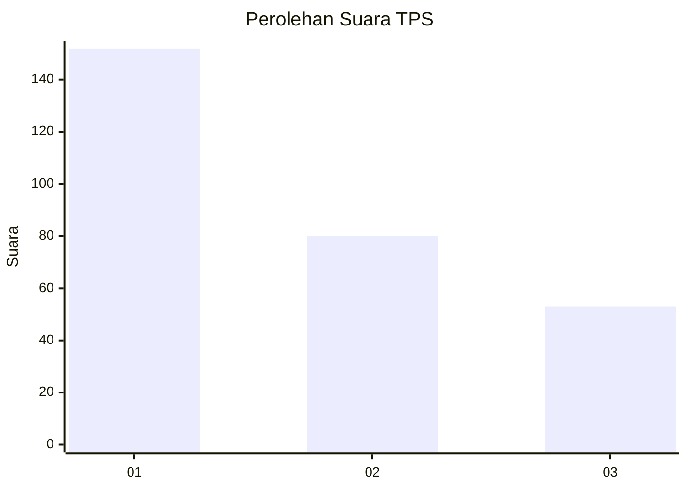
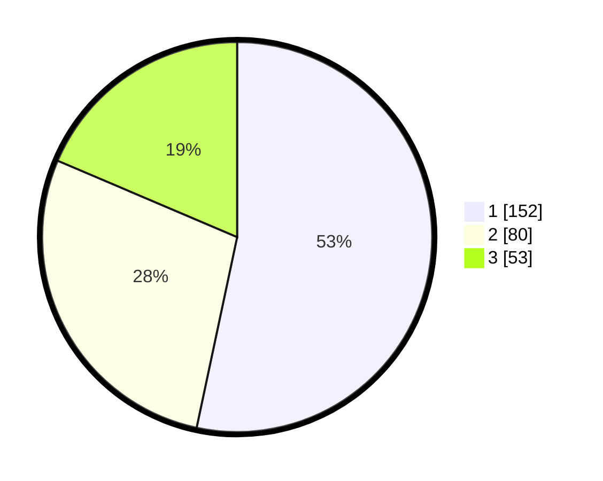

# Hasil

## Grafik

## Tabel

| No. | Nama Paslon    | Suara | Suara (raw) | Persentase |
|:--- |:-------------- | -----:| -----------:| ----------:|
| 1   | ANIES MUHAIMIN | 152   | [152][p-1]  | 53,33      |
| 2   | PRABOWO GIBRAN | 80    | [80][p-2]   | 28,07      |
| 3   | GANJAR MAHFUD  | 53    | [53][p-3]   | 18,60      |

[p-1]: https://github.com/gigit-pemilu/pemilu-2024/blob/main/pilpres/hitung-suara/sub/36-banten/sub/74-kota-tangerang-selatan/sub/06-pamulang/sub/1001-pamulang-barat/sub/147-tps/sub/paslon-1.txt
[p-2]: https://github.com/gigit-pemilu/pemilu-2024/blob/main/pilpres/hitung-suara/sub/36-banten/sub/74-kota-tangerang-selatan/sub/06-pamulang/sub/1001-pamulang-barat/sub/147-tps/sub/paslon-2.txt
[p-3]: https://github.com/gigit-pemilu/pemilu-2024/blob/main/pilpres/hitung-suara/sub/36-banten/sub/74-kota-tangerang-selatan/sub/06-pamulang/sub/1001-pamulang-barat/sub/147-tps/sub/paslon-3.txt

## Foto C Plano

https://sirekap-obj-formc.kpu.go.id/ce90/pemilu/ppwp/36/74/06/10/01/3674061001147-20240214-221441--8a12f494-5ec1-4ceb-9d1b-4a7750ad7e48.jpg

https://sirekap-obj-formc.kpu.go.id/ce90/pemilu/ppwp/36/74/06/10/01/3674061001147-20240214-221632--cfc9af61-531d-4d40-ba3a-5773ca9f15ec.jpg

https://sirekap-obj-formc.kpu.go.id/ce90/pemilu/ppwp/36/74/06/10/01/3674061001147-20240214-221707--1d6e0039-da91-4535-9a10-3d192d5b563f.jpg

## Metadata

| Key        | Value               |
| ---------- | ------------------- |
| Time Stamp | 2024-02-19 06:16:00 |

