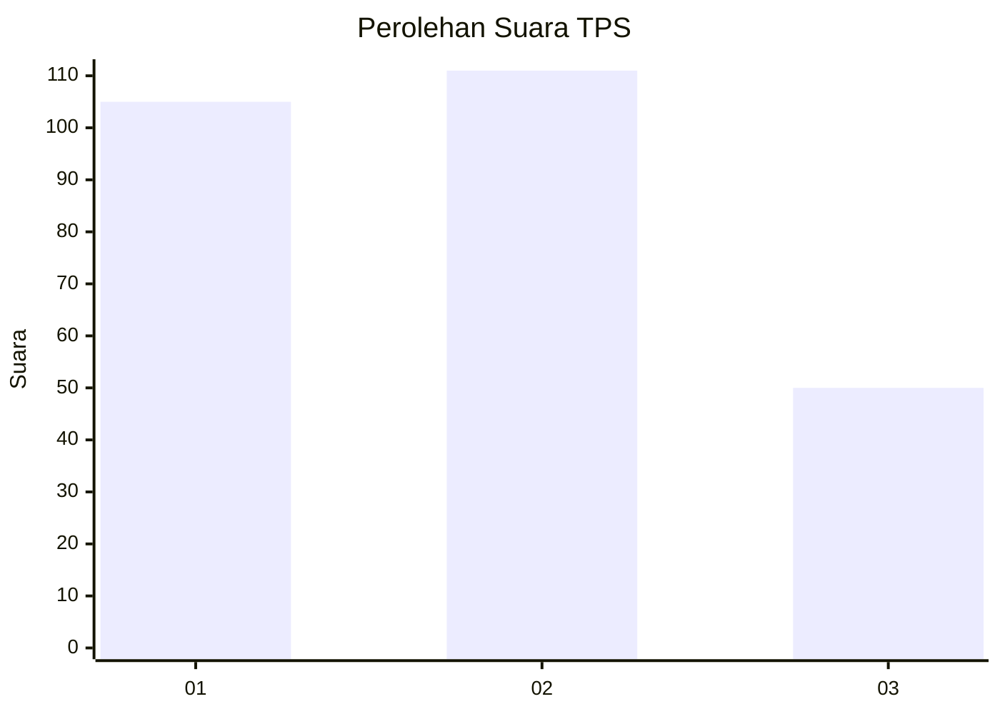
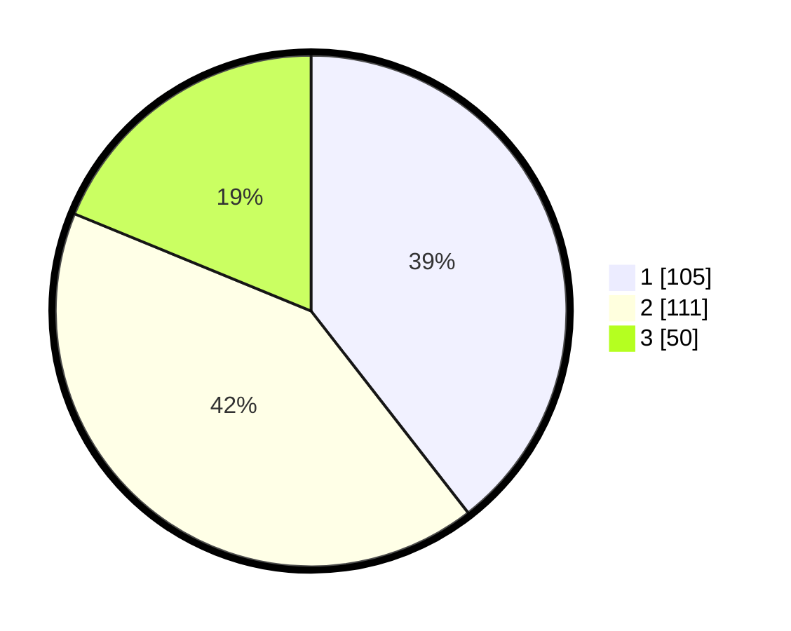

# Hasil

## Grafik

## Tabel

| No. | Nama Paslon    | Suara | Suara (raw) | Persentase |
|:--- |:-------------- | -----:| -----------:| ----------:|
| 1   | ANIES MUHAIMIN | 105   | [105][p-1]  | 39,47      |
| 2   | PRABOWO GIBRAN | 111   | [111][p-2]  | 41,73      |
| 3   | GANJAR MAHFUD  | 50    | [50][p-3]   | 18,80      |

[p-1]: https://github.com/gigit-pemilu/pemilu-2024/blob/main/pilpres/hitung-suara/sub/36-banten/sub/74-kota-tangerang-selatan/sub/06-pamulang/sub/1001-pamulang-barat/sub/156-tps/sub/paslon-1.txt
[p-2]: https://github.com/gigit-pemilu/pemilu-2024/blob/main/pilpres/hitung-suara/sub/36-banten/sub/74-kota-tangerang-selatan/sub/06-pamulang/sub/1001-pamulang-barat/sub/156-tps/sub/paslon-2.txt
[p-3]: https://github.com/gigit-pemilu/pemilu-2024/blob/main/pilpres/hitung-suara/sub/36-banten/sub/74-kota-tangerang-selatan/sub/06-pamulang/sub/1001-pamulang-barat/sub/156-tps/sub/paslon-3.txt

## Foto C Plano

https://sirekap-obj-formc.kpu.go.id/0f76/pemilu/ppwp/36/74/06/10/01/3674061001156-20240302-225143--c8b078d1-8a8a-4ff8-9129-04359146960b.jpg

https://sirekap-obj-formc.kpu.go.id/0f76/pemilu/ppwp/36/74/06/10/01/3674061001156-20240214-160121--9039dda9-68d8-4b82-9226-ad9f7410f02f.jpg

https://sirekap-obj-formc.kpu.go.id/0f76/pemilu/ppwp/36/74/06/10/01/3674061001156-20240302-225232--723b9b7b-e1f8-4ec3-af89-3a24826a56d0.jpg

## Metadata

| Key        | Value               |
| ---------- | ------------------- |
| Time Stamp | 2024-03-02 23:00:00 |

