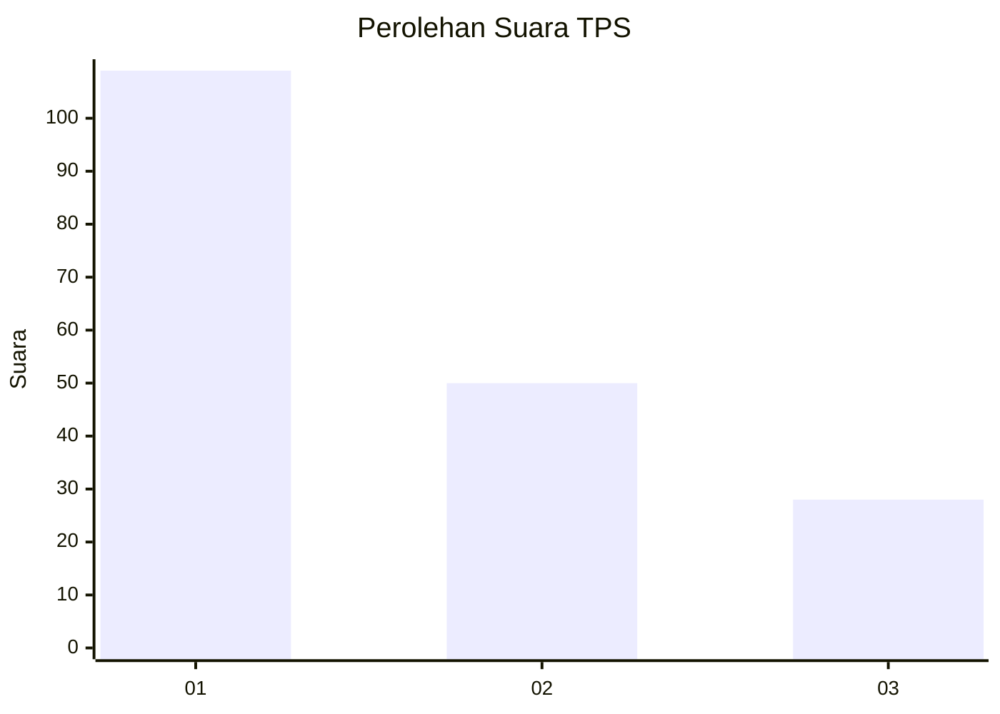
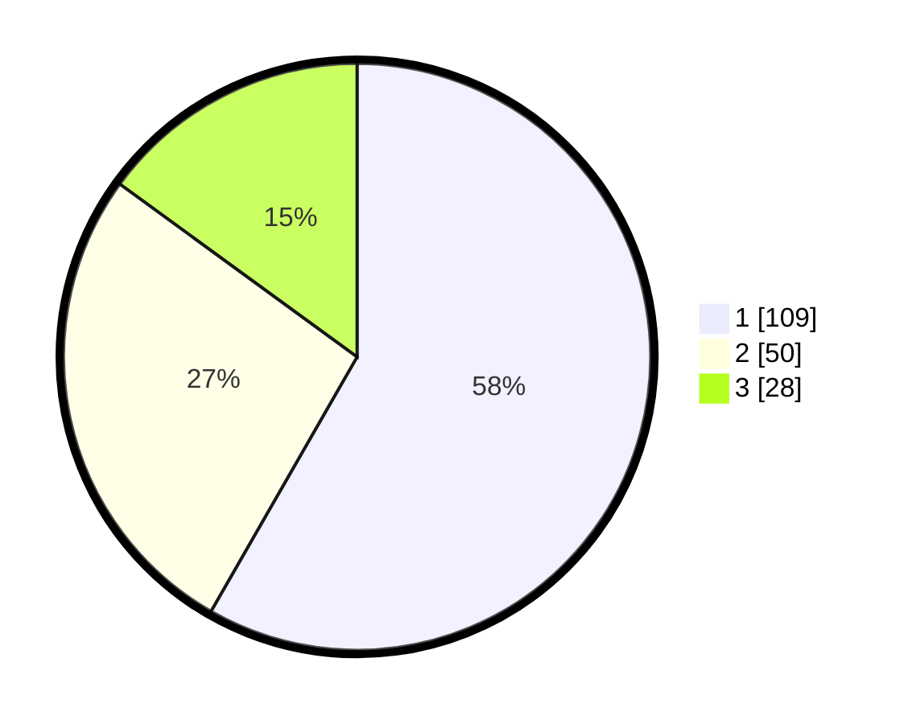

# Hasil

## Grafik

## Tabel

| No. | Nama Paslon    | Suara | Suara (raw) | Persentase |
|:--- |:-------------- | -----:| -----------:| ----------:|
| 1   | ANIES MUHAIMIN | 109   | [109][p-1]  | 58,29      |
| 2   | PRABOWO GIBRAN | 50    | [50][p-2]   | 26,74      |
| 3   | GANJAR MAHFUD  | 28    | [28][p-3]   | 14,97      |

[p-1]: https://github.com/gigit-pemilu/pemilu-2024-36-banten/blob/main/pilpres/hitung-suara/sub/36-banten/sub/74-kota-tangerang-selatan/sub/06-pamulang/sub/1003-pondok-benda/sub/001-tps/sub/paslon-1.txt
[p-2]: https://github.com/gigit-pemilu/pemilu-2024-36-banten/blob/main/pilpres/hitung-suara/sub/36-banten/sub/74-kota-tangerang-selatan/sub/06-pamulang/sub/1003-pondok-benda/sub/001-tps/sub/paslon-2.txt
[p-3]: https://github.com/gigit-pemilu/pemilu-2024-36-banten/blob/main/pilpres/hitung-suara/sub/36-banten/sub/74-kota-tangerang-selatan/sub/06-pamulang/sub/1003-pondok-benda/sub/001-tps/sub/paslon-3.txt

## Foto C Plano

https://sirekap-obj-formc.kpu.go.id/8207/pemilu/ppwp/36/74/06/10/03/3674061003001-20240224-131444--5b423563-fd87-4e80-9cf0-f28ed819456f.jpg

https://sirekap-obj-formc.kpu.go.id/8207/pemilu/ppwp/36/74/06/10/03/3674061003001-20240224-131637--64d9c8b8-4ed2-4c2b-9d14-2c23270bcebc.jpg

https://sirekap-obj-formc.kpu.go.id/8207/pemilu/ppwp/36/74/06/10/03/3674061003001-20240224-131754--d3f20985-7124-4417-96b9-790d002d44db.jpg

## Metadata

| Key        | Value               |
| ---------- | ------------------- |
| Time Stamp | 2024-02-24 22:31:28 |

## DATA PEMILIH TETAP

Jumlah pemilih dalam DPT: **777**.
 * L: **555**.
 * P: **757**.

## DATA PENGGUNA HAK PILIH

Jumlah pengguna hak pilih dalam DPT: **777**.
 * L: **555**.
 * P: **575**.

Jumlah pengguna hak pilih dalam DPTb: **777**.
 * L: **507**.
 * P: **775**.

Jumlah pengguna hak pilih dalam DPK: **887**.
 * L: **2**.
 * P: **84**.

Jumlah pengguna hak pilih: **327**.
 * L: **711**.
 * P: **111**.

## JUMLAH SUARA SAH DAN TIDAK SAH

JUMLAH SELURUH SUARA SAH: **227**.

JUMLAH SUARA TIDAK SAH: **2**.

JUMLAH SELURUH SUARA SAH DAN SUARA TIDAK SAH: **230**.

