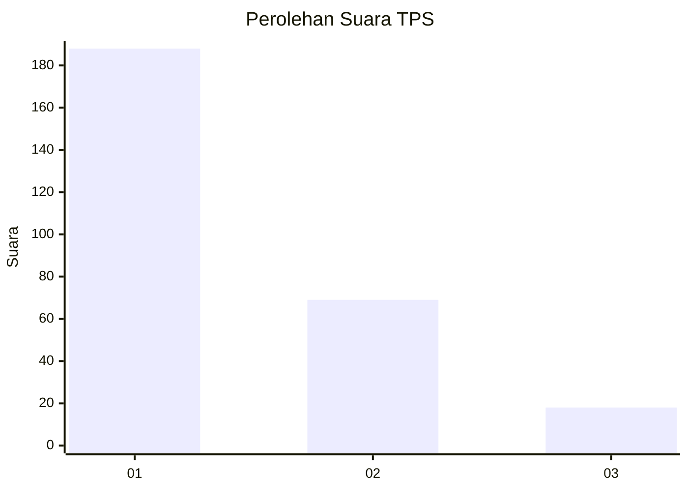
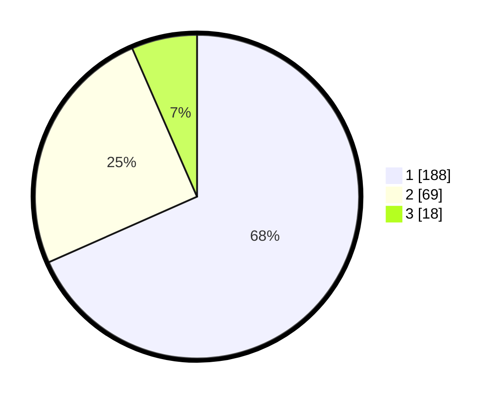

# Hasil

## Grafik

## Tabel

| No. | Nama Paslon    | Suara | Suara (raw) | Persentase |
|:--- |:-------------- | -----:| -----------:| ----------:|
| 1   | ANIES MUHAIMIN | 188   | [188][p-1]  | 68,36      |
| 2   | PRABOWO GIBRAN | 69    | [69][p-2]   | 25,09      |
| 3   | GANJAR MAHFUD  | 18    | [18][p-3]   | 6,55       |

[p-1]: https://github.com/gigit-pemilu/pemilu-2024/blob/main/pilpres/hitung-suara/sub/36-banten/sub/74-kota-tangerang-selatan/sub/06-pamulang/sub/1003-pondok-benda/sub/138-tps/sub/paslon-1.txt
[p-2]: https://github.com/gigit-pemilu/pemilu-2024/blob/main/pilpres/hitung-suara/sub/36-banten/sub/74-kota-tangerang-selatan/sub/06-pamulang/sub/1003-pondok-benda/sub/138-tps/sub/paslon-2.txt
[p-3]: https://github.com/gigit-pemilu/pemilu-2024/blob/main/pilpres/hitung-suara/sub/36-banten/sub/74-kota-tangerang-selatan/sub/06-pamulang/sub/1003-pondok-benda/sub/138-tps/sub/paslon-3.txt

## Foto C Plano

https://sirekap-obj-formc.kpu.go.id/16ed/pemilu/ppwp/36/74/06/10/03/3674061003138-20240215-010118--528b62e2-9632-44d7-bd09-120f3ac9b867.jpg

https://sirekap-obj-formc.kpu.go.id/16ed/pemilu/ppwp/36/74/06/10/03/3674061003138-20240215-010247--cad6362e-8ac0-43e6-b4cf-57cd14821df8.jpg

https://sirekap-obj-formc.kpu.go.id/16ed/pemilu/ppwp/36/74/06/10/03/3674061003138-20240215-010347--229fa70f-7391-4115-a129-6ed4441c8c74.jpg

## Metadata

| Key        | Value               |
| ---------- | ------------------- |
| Time Stamp | 2024-02-16 16:25:10 |

