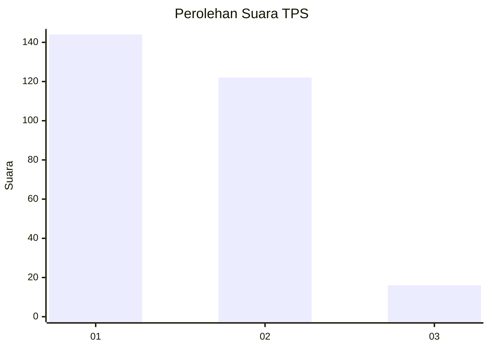
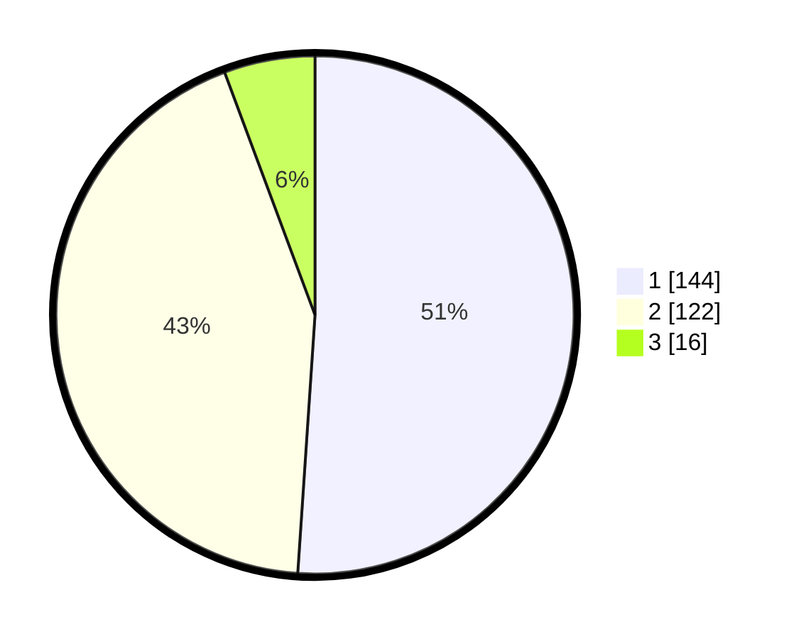

# Hasil

## Grafik

## Tabel

| No. | Nama Paslon    | Suara | Suara (raw) | Persentase |
|:--- |:-------------- | -----:| -----------:| ----------:|
| 1   | ANIES MUHAIMIN | 144   | [144][p-1]  | 51,06      |
| 2   | PRABOWO GIBRAN | 122   | [122][p-2]  | 43,26      |
| 3   | GANJAR MAHFUD  | 16    | [16][p-3]   | 5,67       |

[p-1]: https://github.com/gigit-pemilu/pemilu-2024/blob/main/pilpres/hitung-suara/sub/36-banten/sub/74-kota-tangerang-selatan/sub/06-pamulang/sub/1004-pondok-cabe-udik/sub/007-tps/sub/paslon-1.txt
[p-2]: https://github.com/gigit-pemilu/pemilu-2024/blob/main/pilpres/hitung-suara/sub/36-banten/sub/74-kota-tangerang-selatan/sub/06-pamulang/sub/1004-pondok-cabe-udik/sub/007-tps/sub/paslon-2.txt
[p-3]: https://github.com/gigit-pemilu/pemilu-2024/blob/main/pilpres/hitung-suara/sub/36-banten/sub/74-kota-tangerang-selatan/sub/06-pamulang/sub/1004-pondok-cabe-udik/sub/007-tps/sub/paslon-3.txt

## Foto C Plano

https://sirekap-obj-formc.kpu.go.id/0f99/pemilu/ppwp/36/74/06/10/04/3674061004007-20240221-121255--61d1576d-88e8-440d-ac58-12b1f81be795.jpg

https://sirekap-obj-formc.kpu.go.id/0f99/pemilu/ppwp/36/74/06/10/04/3674061004007-20240221-121404--4e05ccdc-cc6e-48db-9991-9e3c684cd9ee.jpg

https://sirekap-obj-formc.kpu.go.id/0f99/pemilu/ppwp/36/74/06/10/04/3674061004007-20240221-121552--b007ac5d-89f7-4319-b70c-e02114feadbe.jpg

## Metadata

| Key        | Value               |
| ---------- | ------------------- |
| Time Stamp | 2024-02-21 13:00:00 |

