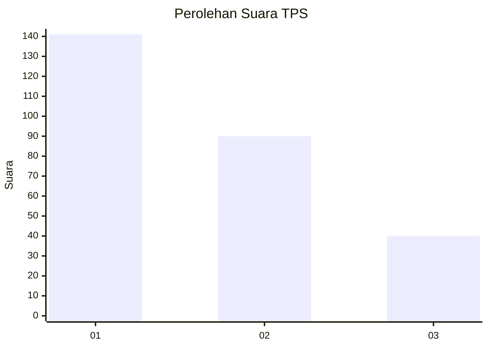
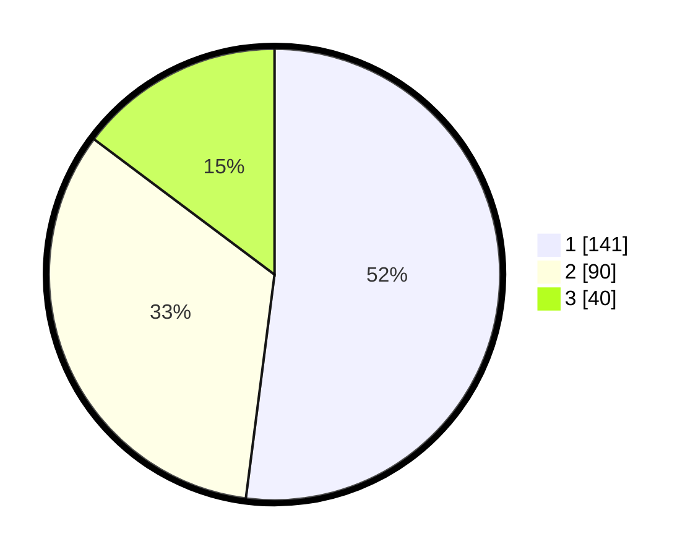

# Hasil

## Grafik

## Tabel

| No. | Nama Paslon    | Suara | Suara (raw) | Persentase |
|:--- |:-------------- | -----:| -----------:| ----------:|
| 1   | ANIES MUHAIMIN | 141   | [141][p-1]  | 52,03      |
| 2   | PRABOWO GIBRAN | 90    | [90][p-2]   | 33,21      |
| 3   | GANJAR MAHFUD  | 40    | [40][p-3]   | 14,76      |

[p-1]: https://github.com/gigit-pemilu/pemilu-2024-36-banten/blob/main/pilpres/hitung-suara/sub/36-banten/sub/74-kota-tangerang-selatan/sub/06-pamulang/sub/1007-bambu-apus/sub/050-tps/sub/paslon-1.txt
[p-2]: https://github.com/gigit-pemilu/pemilu-2024-36-banten/blob/main/pilpres/hitung-suara/sub/36-banten/sub/74-kota-tangerang-selatan/sub/06-pamulang/sub/1007-bambu-apus/sub/050-tps/sub/paslon-2.txt
[p-3]: https://github.com/gigit-pemilu/pemilu-2024-36-banten/blob/main/pilpres/hitung-suara/sub/36-banten/sub/74-kota-tangerang-selatan/sub/06-pamulang/sub/1007-bambu-apus/sub/050-tps/sub/paslon-3.txt

## Foto C Plano

https://sirekap-obj-formc.kpu.go.id/3731/pemilu/ppwp/36/74/06/10/07/3674061007050-20240215-001757--7a83eef0-b5be-4311-8934-279531431db0.jpg

https://sirekap-obj-formc.kpu.go.id/3731/pemilu/ppwp/36/74/06/10/07/3674061007050-20240215-001956--8b861340-749e-4c19-bdd5-96704beb2ab1.jpg

https://sirekap-obj-formc.kpu.go.id/3731/pemilu/ppwp/36/74/06/10/07/3674061007050-20240215-002103--c52d3632-4192-4276-b3be-7e2012a402e5.jpg

## Metadata

| Key        | Value               |
| ---------- | ------------------- |
| Time Stamp | 2024-02-17 19:30:00 |

