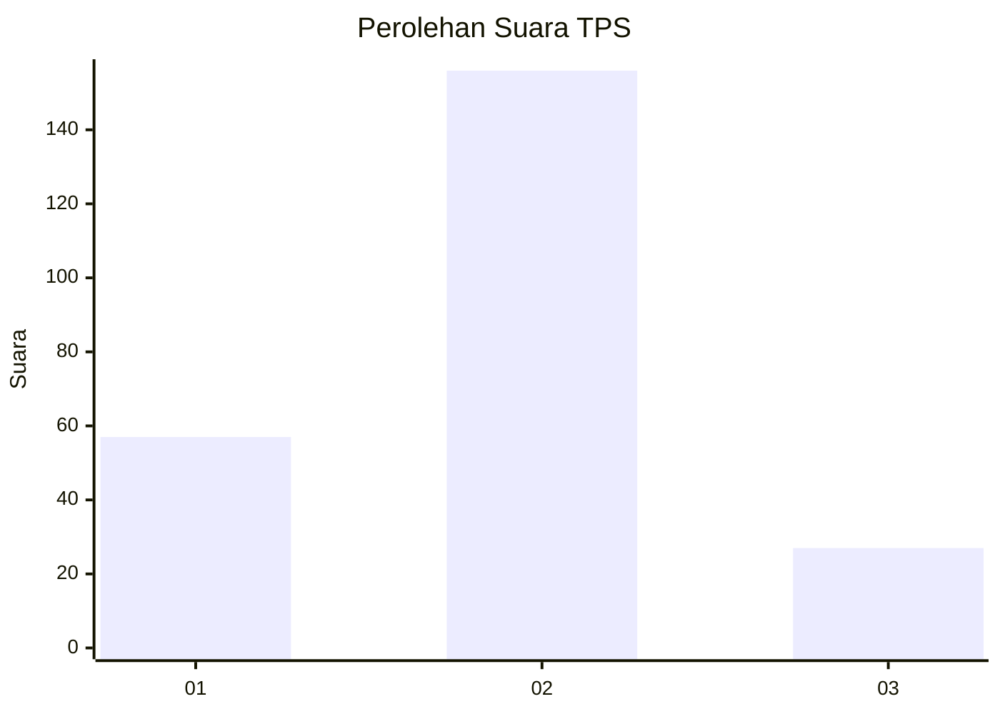
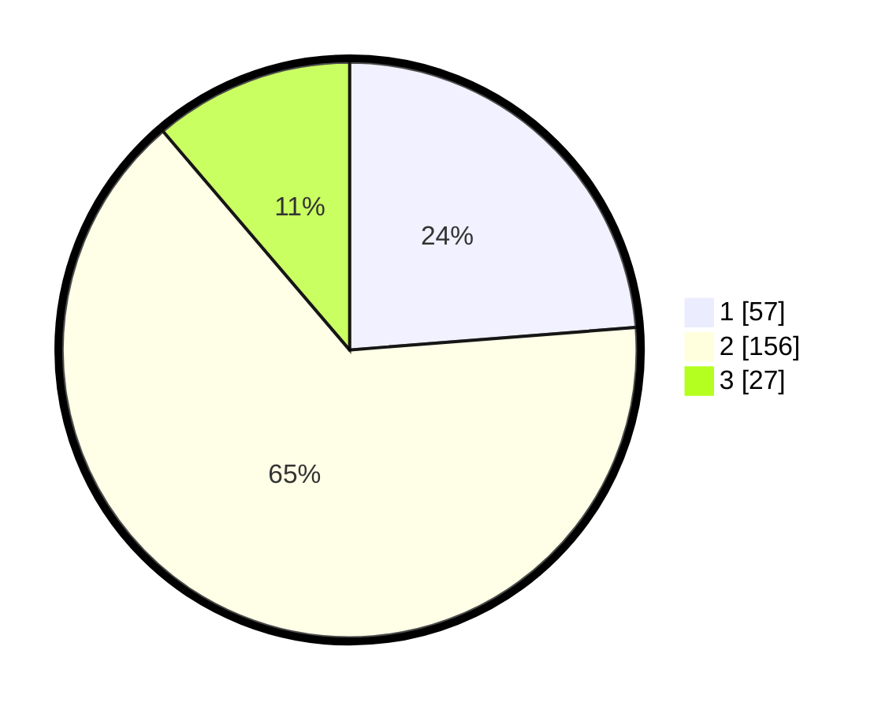

# Hasil

## Grafik

## Tabel

| No. | Nama Paslon    | Suara | Suara (raw) | Persentase |
|:--- |:-------------- | -----:| -----------:| ----------:|
| 1   | ANIES MUHAIMIN | 57    | [57][p-1]   | 23,75      |
| 2   | PRABOWO GIBRAN | 156   | [156][p-2]  | 65,00      |
| 3   | GANJAR MAHFUD  | 27    | [27][p-3]   | 11,25      |

[p-1]: https://github.com/gigit-pemilu/pemilu-2024/blob/main/pilpres/hitung-suara/sub/36-banten/sub/74-kota-tangerang-selatan/sub/07-setu/sub/1001-muncul/sub/001-tps/sub/paslon-1.txt
[p-2]: https://github.com/gigit-pemilu/pemilu-2024/blob/main/pilpres/hitung-suara/sub/36-banten/sub/74-kota-tangerang-selatan/sub/07-setu/sub/1001-muncul/sub/001-tps/sub/paslon-2.txt
[p-3]: https://github.com/gigit-pemilu/pemilu-2024/blob/main/pilpres/hitung-suara/sub/36-banten/sub/74-kota-tangerang-selatan/sub/07-setu/sub/1001-muncul/sub/001-tps/sub/paslon-3.txt

## Foto C Plano

https://sirekap-obj-formc.kpu.go.id/64bc/pemilu/ppwp/36/74/07/10/01/3674071001001-20240221-143510--e69b2dcf-9d13-4095-9184-8b065e5fec02.jpg

https://sirekap-obj-formc.kpu.go.id/64bc/pemilu/ppwp/36/74/07/10/01/3674071001001-20240221-143547--24d0e5c7-e2af-4663-a39f-d9847e9672a0.jpg

https://sirekap-obj-formc.kpu.go.id/64bc/pemilu/ppwp/36/74/07/10/01/3674071001001-20240221-143622--de14934f-973f-409b-8d84-df7c24f1eb73.jpg

## Metadata

| Key        | Value               |
| ---------- | ------------------- |
| Time Stamp | 2024-02-25 14:00:00 |

