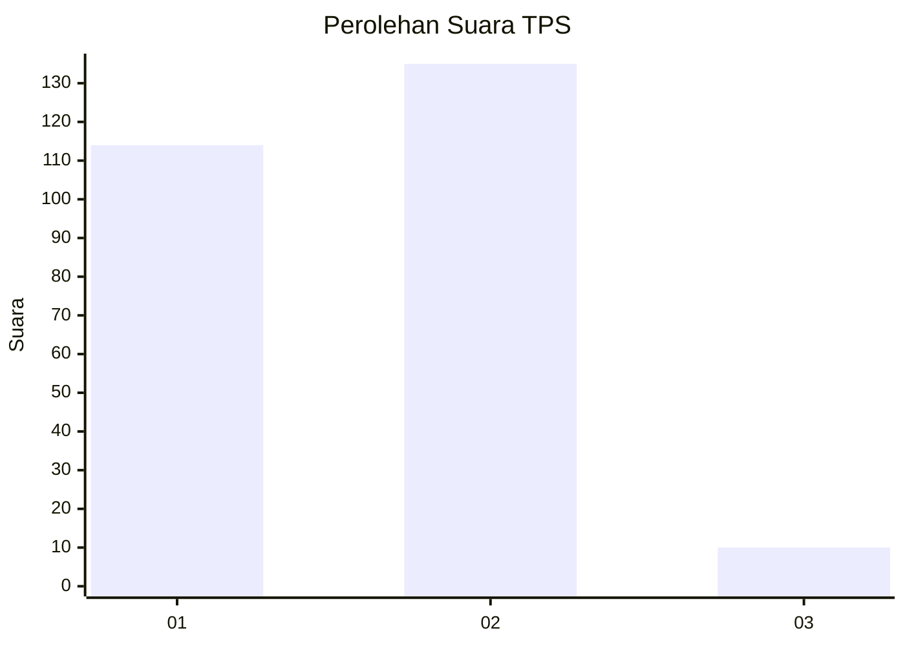
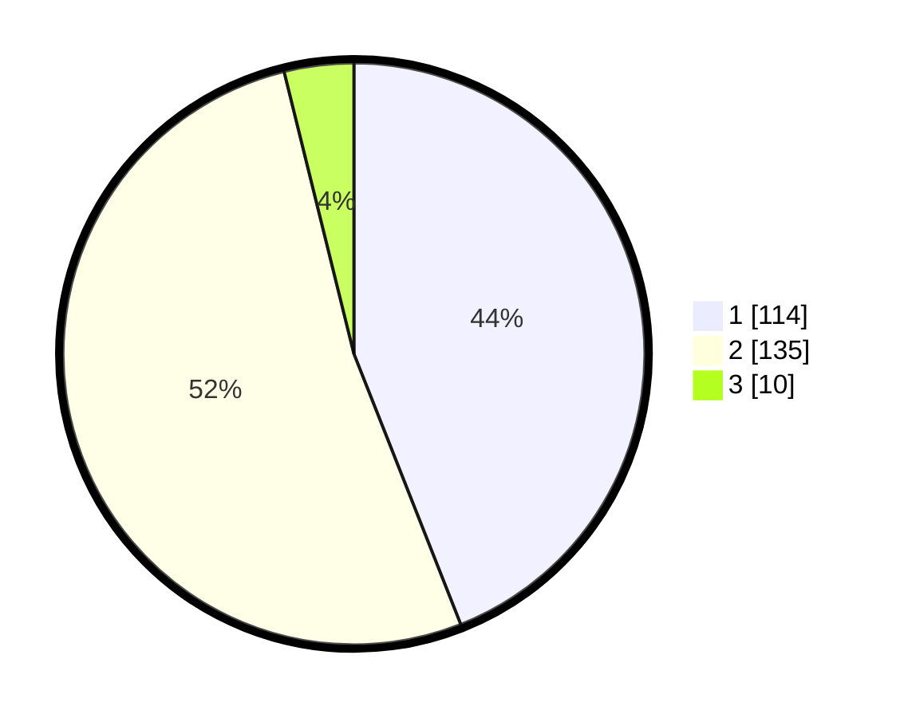

# Hasil

## Grafik

## Tabel

| No. | Nama Paslon    | Suara | Suara (raw) | Persentase |
|:--- |:-------------- | -----:| -----------:| ----------:|
| 1   | ANIES MUHAIMIN | 114   | [114][p-1]  | 44,02      |
| 2   | PRABOWO GIBRAN | 135   | [135][p-2]  | 52,12      |
| 3   | GANJAR MAHFUD  | 10    | [10][p-3]   | 3,86       |

[p-1]: https://github.com/gigit-pemilu/pemilu-2024-36-banten/blob/main/pilpres/hitung-suara/sub/36-banten/sub/74-kota-tangerang-selatan/sub/07-setu/sub/1001-muncul/sub/004-tps/sub/paslon-1.txt
[p-2]: https://github.com/gigit-pemilu/pemilu-2024-36-banten/blob/main/pilpres/hitung-suara/sub/36-banten/sub/74-kota-tangerang-selatan/sub/07-setu/sub/1001-muncul/sub/004-tps/sub/paslon-2.txt
[p-3]: https://github.com/gigit-pemilu/pemilu-2024-36-banten/blob/main/pilpres/hitung-suara/sub/36-banten/sub/74-kota-tangerang-selatan/sub/07-setu/sub/1001-muncul/sub/004-tps/sub/paslon-3.txt

## Foto C Plano

https://sirekap-obj-formc.kpu.go.id/c345/pemilu/ppwp/36/74/07/10/01/3674071001004-20240215-001731--582448bd-0d97-47ad-871a-0a5ca427c204.jpg

https://sirekap-obj-formc.kpu.go.id/c345/pemilu/ppwp/36/74/07/10/01/3674071001004-20240215-001906--4b1be74b-7828-42de-ad05-ab3f5b2b399f.jpg

https://sirekap-obj-formc.kpu.go.id/c345/pemilu/ppwp/36/74/07/10/01/3674071001004-20240215-002020--7d224e09-cf7a-4077-a9ec-7813ff754750.jpg

## Metadata

| Key        | Value               |
| ---------- | ------------------- |
| Time Stamp | 2024-02-15 17:30:25 |

