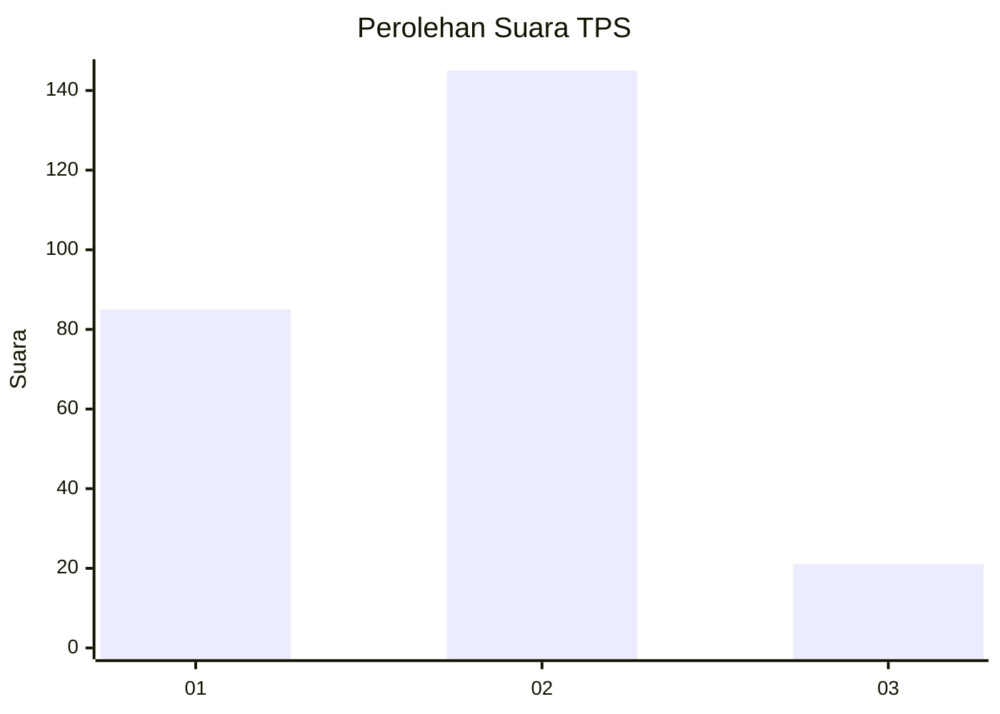
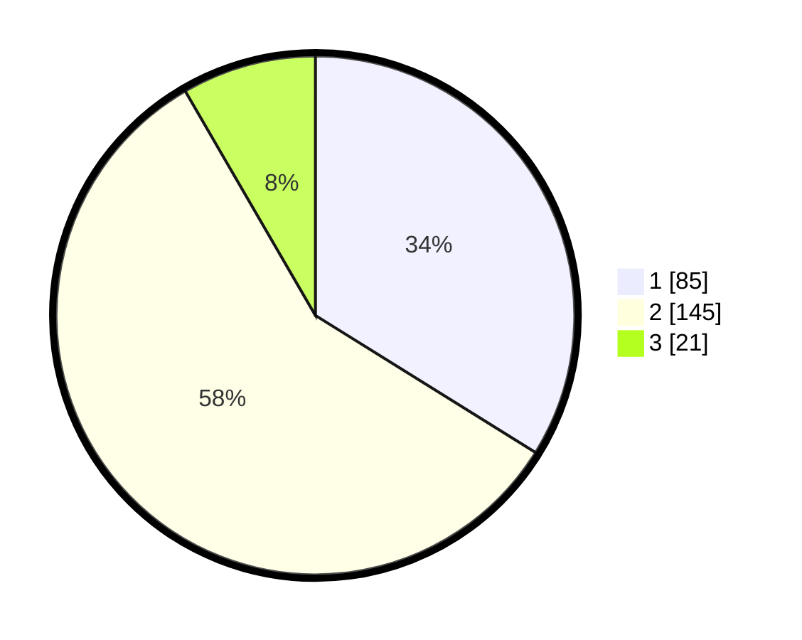

# Hasil

## Grafik

## Tabel

| No. | Nama Paslon    | Suara | Suara (raw) | Persentase |
|:--- |:-------------- | -----:| -----------:| ----------:|
| 1   | ANIES MUHAIMIN | 85    | [85][p-1]   | 33,86      |
| 2   | PRABOWO GIBRAN | 145   | [145][p-2]  | 57,77      |
| 3   | GANJAR MAHFUD  | 21    | [21][p-3]   | 8,37       |

[p-1]: https://github.com/gigit-pemilu/pemilu-2024-36-banten/blob/main/pilpres/hitung-suara/sub/36-banten/sub/74-kota-tangerang-selatan/sub/07-setu/sub/1001-muncul/sub/006-tps/sub/paslon-1.txt
[p-2]: https://github.com/gigit-pemilu/pemilu-2024-36-banten/blob/main/pilpres/hitung-suara/sub/36-banten/sub/74-kota-tangerang-selatan/sub/07-setu/sub/1001-muncul/sub/006-tps/sub/paslon-2.txt
[p-3]: https://github.com/gigit-pemilu/pemilu-2024-36-banten/blob/main/pilpres/hitung-suara/sub/36-banten/sub/74-kota-tangerang-selatan/sub/07-setu/sub/1001-muncul/sub/006-tps/sub/paslon-3.txt

## Foto C Plano

https://sirekap-obj-formc.kpu.go.id/6f18/pemilu/ppwp/36/74/07/10/01/3674071001006-20240215-205008--6a80d21c-4f2e-49c5-9f06-35d78cf87c4b.jpg

https://sirekap-obj-formc.kpu.go.id/6f18/pemilu/ppwp/36/74/07/10/01/3674071001006-20240214-185914--2eba002b-9428-4c3e-8a1f-68b1bca939aa.jpg

https://sirekap-obj-formc.kpu.go.id/6f18/pemilu/ppwp/36/74/07/10/01/3674071001006-20240215-205222--b7b7998c-1cac-4674-9bd4-57b3ea9efebc.jpg

## Metadata

| Key        | Value               |
| ---------- | ------------------- |
| Time Stamp | 2024-02-17 13:37:34 |

