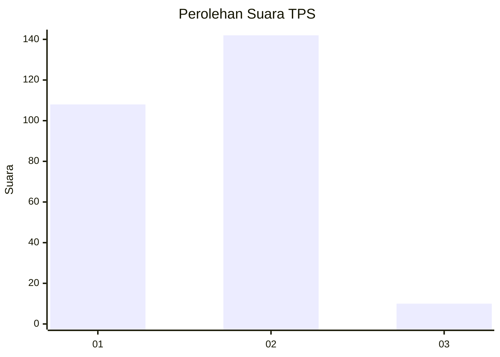
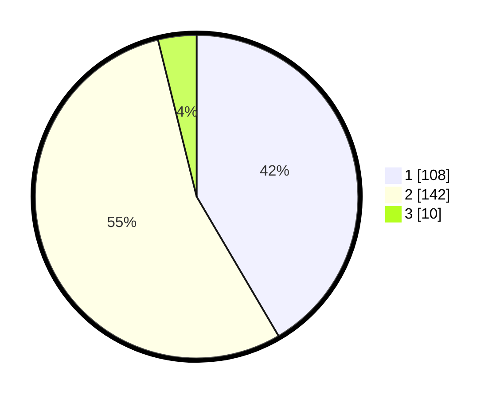

# Hasil

## Grafik

## Tabel

| No. | Nama Paslon    | Suara | Suara (raw) | Persentase |
|:--- |:-------------- | -----:| -----------:| ----------:|
| 1   | ANIES MUHAIMIN | 108   | [108][p-1]  | 41,54      |
| 2   | PRABOWO GIBRAN | 142   | [142][p-2]  | 54,62      |
| 3   | GANJAR MAHFUD  | 10    | [10][p-3]   | 3,85       |

[p-1]: https://github.com/gigit-pemilu/pemilu-2024/blob/main/pilpres/hitung-suara/sub/36-banten/sub/74-kota-tangerang-selatan/sub/07-setu/sub/1001-muncul/sub/007-tps/sub/paslon-1.txt
[p-2]: https://github.com/gigit-pemilu/pemilu-2024/blob/main/pilpres/hitung-suara/sub/36-banten/sub/74-kota-tangerang-selatan/sub/07-setu/sub/1001-muncul/sub/007-tps/sub/paslon-2.txt
[p-3]: https://github.com/gigit-pemilu/pemilu-2024/blob/main/pilpres/hitung-suara/sub/36-banten/sub/74-kota-tangerang-selatan/sub/07-setu/sub/1001-muncul/sub/007-tps/sub/paslon-3.txt

## Foto C Plano

https://sirekap-obj-formc.kpu.go.id/59df/pemilu/ppwp/36/74/07/10/01/3674071001007-20240221-204531--f9ba1f8c-1f24-4c8b-b38c-07f7b1083ee8.jpg

https://sirekap-obj-formc.kpu.go.id/59df/pemilu/ppwp/36/74/07/10/01/3674071001007-20240221-204558--1ccce0d0-acee-4b3f-bc80-ddc96fe981e5.jpg

https://sirekap-obj-formc.kpu.go.id/59df/pemilu/ppwp/36/74/07/10/01/3674071001007-20240221-204649--a2302fa0-480a-4687-b92f-eea46599821f.jpg

## Metadata

| Key        | Value               |
| ---------- | ------------------- |
| Time Stamp | 2024-02-26 18:00:00 |

