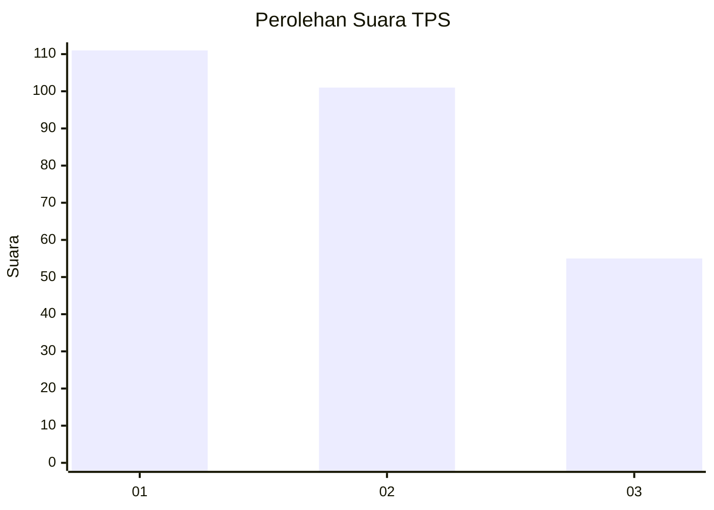
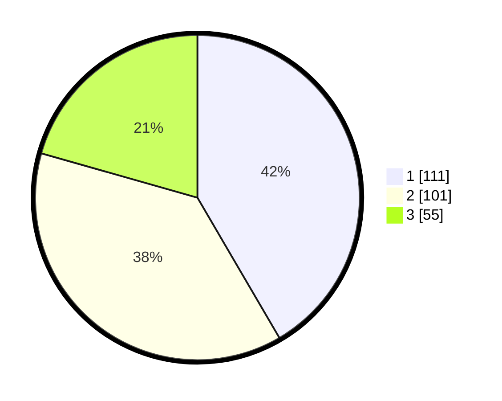

# Hasil

## Grafik

## Tabel

| No. | Nama Paslon    | Suara | Suara (raw) | Persentase |
|:--- |:-------------- | -----:| -----------:| ----------:|
| 1   | ANIES MUHAIMIN | 111   | [111][p-1]  | 41,57      |
| 2   | PRABOWO GIBRAN | 101   | [101][p-2]  | 37,83      |
| 3   | GANJAR MAHFUD  | 55    | [55][p-3]   | 20,60      |

[p-1]: https://github.com/gigit-pemilu/pemilu-2024/blob/main/pilpres/hitung-suara/sub/36-banten/sub/74-kota-tangerang-selatan/sub/07-setu/sub/1002-setu/sub/007-tps/sub/paslon-1.txt
[p-2]: https://github.com/gigit-pemilu/pemilu-2024/blob/main/pilpres/hitung-suara/sub/36-banten/sub/74-kota-tangerang-selatan/sub/07-setu/sub/1002-setu/sub/007-tps/sub/paslon-2.txt
[p-3]: https://github.com/gigit-pemilu/pemilu-2024/blob/main/pilpres/hitung-suara/sub/36-banten/sub/74-kota-tangerang-selatan/sub/07-setu/sub/1002-setu/sub/007-tps/sub/paslon-3.txt

## Foto C Plano

https://sirekap-obj-formc.kpu.go.id/87c6/pemilu/ppwp/36/74/07/10/02/3674071002007-20240227-034509--4be12008-7a4e-4eca-a325-a6c7ae94b14d.jpg

https://sirekap-obj-formc.kpu.go.id/87c6/pemilu/ppwp/36/74/07/10/02/3674071002007-20240214-213613--a7df37cd-5bfe-4973-ba97-ee41b99ee028.jpg

https://sirekap-obj-formc.kpu.go.id/87c6/pemilu/ppwp/36/74/07/10/02/3674071002007-20240214-213629--3a01060d-6916-4de3-b195-b237d6615892.jpg

## Metadata

| Key        | Value               |
| ---------- | ------------------- |
| Time Stamp | 2024-02-27 04:00:00 |

