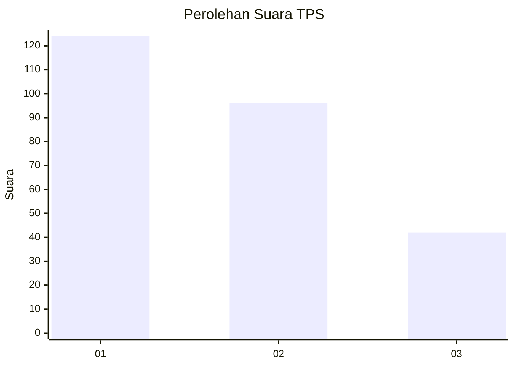
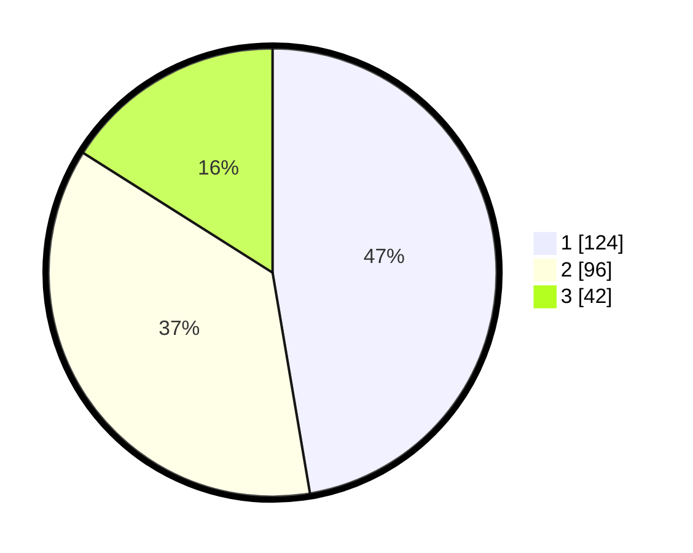

# Hasil

## Grafik

## Tabel

| No. | Nama Paslon    | Suara | Suara (raw) | Persentase |
|:--- |:-------------- | -----:| -----------:| ----------:|
| 1   | ANIES MUHAIMIN | 124   | [124][p-1]  | 47,33      |
| 2   | PRABOWO GIBRAN | 96    | [96][p-2]   | 36,64      |
| 3   | GANJAR MAHFUD  | 42    | [42][p-3]   | 16,03      |

[p-1]: https://github.com/gigit-pemilu/pemilu-2024-36-banten/blob/main/pilpres/hitung-suara/sub/36-banten/sub/74-kota-tangerang-selatan/sub/07-setu/sub/1002-setu/sub/008-tps/sub/paslon-1.txt
[p-2]: https://github.com/gigit-pemilu/pemilu-2024-36-banten/blob/main/pilpres/hitung-suara/sub/36-banten/sub/74-kota-tangerang-selatan/sub/07-setu/sub/1002-setu/sub/008-tps/sub/paslon-2.txt
[p-3]: https://github.com/gigit-pemilu/pemilu-2024-36-banten/blob/main/pilpres/hitung-suara/sub/36-banten/sub/74-kota-tangerang-selatan/sub/07-setu/sub/1002-setu/sub/008-tps/sub/paslon-3.txt

## Foto C Plano

https://sirekap-obj-formc.kpu.go.id/1cd7/pemilu/ppwp/36/74/07/10/02/3674071002008-20240214-221335--09a56705-08f0-4063-80c7-632df276111e.jpg

https://sirekap-obj-formc.kpu.go.id/1cd7/pemilu/ppwp/36/74/07/10/02/3674071002008-20240214-221504--4d2b41e7-5654-45f3-b18b-63883a62b789.jpg

https://sirekap-obj-formc.kpu.go.id/1cd7/pemilu/ppwp/36/74/07/10/02/3674071002008-20240214-221639--31861c60-06eb-45e4-b504-57088914eaa3.jpg

## Metadata

| Key        | Value               |
| ---------- | ------------------- |
| Time Stamp | 2024-02-17 13:37:34 |

