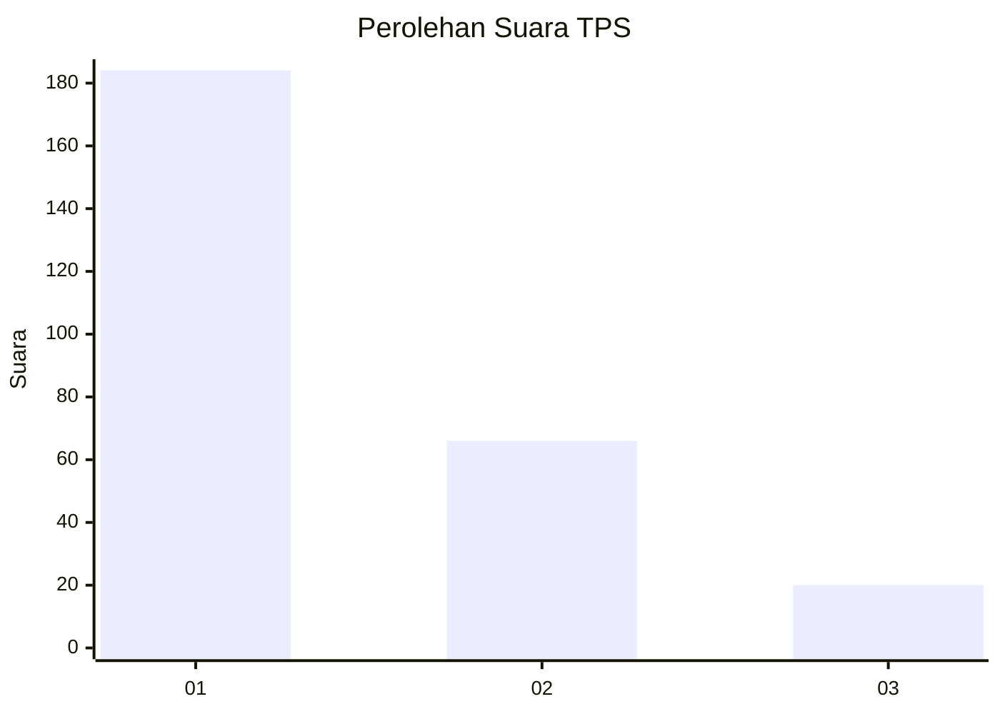
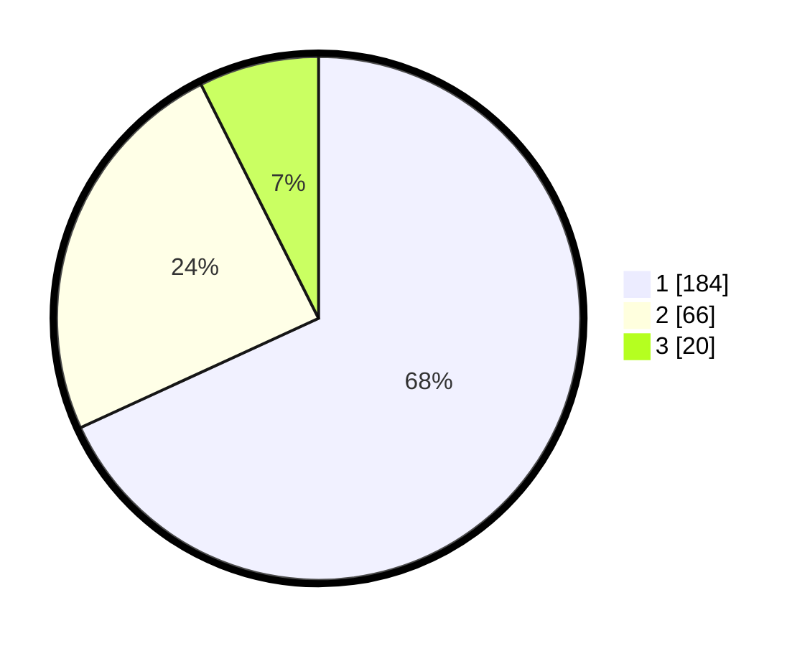

# Hasil

## Grafik

## Tabel

| No. | Nama Paslon    | Suara | Suara (raw) | Persentase |
|:--- |:-------------- | -----:| -----------:| ----------:|
| 1   | ANIES MUHAIMIN | 184   | [184][p-1]  | 68,15      |
| 2   | PRABOWO GIBRAN | 66    | [66][p-2]   | 24,44      |
| 3   | GANJAR MAHFUD  | 20    | [20][p-3]   | 7,41       |

[p-1]: https://github.com/gigit-pemilu/pemilu-2024/blob/main/pilpres/hitung-suara/sub/36-banten/sub/74-kota-tangerang-selatan/sub/07-setu/sub/1002-setu/sub/035-tps/sub/paslon-1.txt
[p-2]: https://github.com/gigit-pemilu/pemilu-2024/blob/main/pilpres/hitung-suara/sub/36-banten/sub/74-kota-tangerang-selatan/sub/07-setu/sub/1002-setu/sub/035-tps/sub/paslon-2.txt
[p-3]: https://github.com/gigit-pemilu/pemilu-2024/blob/main/pilpres/hitung-suara/sub/36-banten/sub/74-kota-tangerang-selatan/sub/07-setu/sub/1002-setu/sub/035-tps/sub/paslon-3.txt

## Foto C Plano

https://sirekap-obj-formc.kpu.go.id/e953/pemilu/ppwp/36/74/07/10/02/3674071002035-20240227-031407--159f8af1-817d-4cb6-b4fe-d288289b56d4.jpg

https://sirekap-obj-formc.kpu.go.id/e953/pemilu/ppwp/36/74/07/10/02/3674071002035-20240215-163914--77c01ca3-26ab-4f26-8a71-a66ae9bfd162.jpg

https://sirekap-obj-formc.kpu.go.id/e953/pemilu/ppwp/36/74/07/10/02/3674071002035-20240227-031448--8f23e274-ca35-4ce0-b8b7-1cc7e99dbc1b.jpg

## Metadata

| Key        | Value               |
| ---------- | ------------------- |
| Time Stamp | 2024-02-27 04:00:00 |

