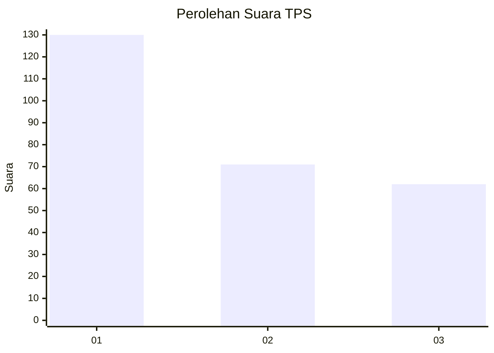
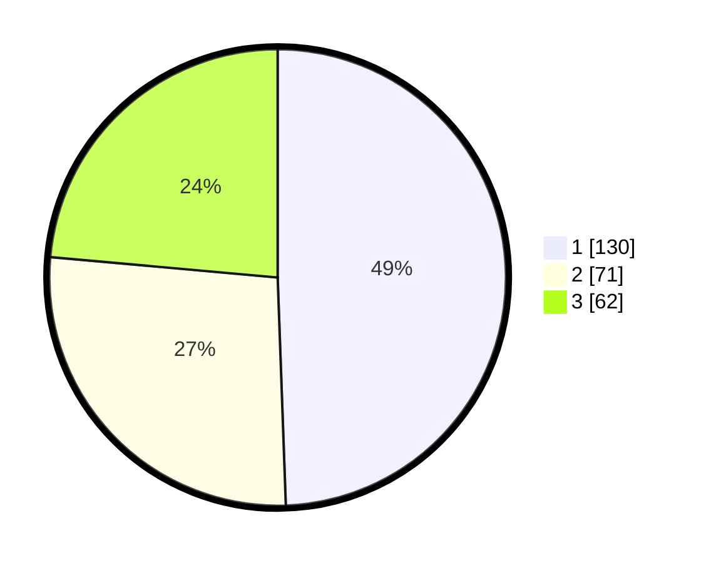

# Hasil

## Grafik

## Tabel

| No. | Nama Paslon    | Suara | Suara (raw) | Persentase |
|:--- |:-------------- | -----:| -----------:| ----------:|
| 1   | ANIES MUHAIMIN | 130   | [130][p-1]  | 49,43      |
| 2   | PRABOWO GIBRAN | 71    | [71][p-2]   | 27,00      |
| 3   | GANJAR MAHFUD  | 62    | [62][p-3]   | 23,57      |

[p-1]: https://github.com/gigit-pemilu/pemilu-2024/blob/main/pilpres/hitung-suara/sub/36-banten/sub/74-kota-tangerang-selatan/sub/07-setu/sub/1002-setu/sub/036-tps/sub/paslon-1.txt
[p-2]: https://github.com/gigit-pemilu/pemilu-2024/blob/main/pilpres/hitung-suara/sub/36-banten/sub/74-kota-tangerang-selatan/sub/07-setu/sub/1002-setu/sub/036-tps/sub/paslon-2.txt
[p-3]: https://github.com/gigit-pemilu/pemilu-2024/blob/main/pilpres/hitung-suara/sub/36-banten/sub/74-kota-tangerang-selatan/sub/07-setu/sub/1002-setu/sub/036-tps/sub/paslon-3.txt

## Foto C Plano

https://sirekap-obj-formc.kpu.go.id/71d4/pemilu/ppwp/36/74/07/10/02/3674071002036-20240222-212934--c4880291-8fd5-47b2-b0e7-bc48c1ddcb4f.jpg

https://sirekap-obj-formc.kpu.go.id/71d4/pemilu/ppwp/36/74/07/10/02/3674071002036-20240215-034145--09a8bb70-06f9-4f85-9d1b-5447db75f3bf.jpg

https://sirekap-obj-formc.kpu.go.id/71d4/pemilu/ppwp/36/74/07/10/02/3674071002036-20240222-213020--2e7dce3f-14cd-476c-99e0-b9b6b7ae448c.jpg

## Metadata

| Key        | Value               |
| ---------- | ------------------- |
| Time Stamp | 2024-02-22 22:00:00 |

