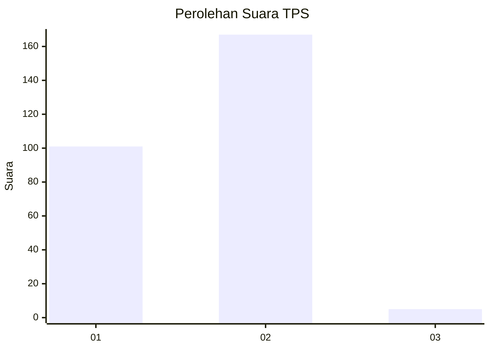
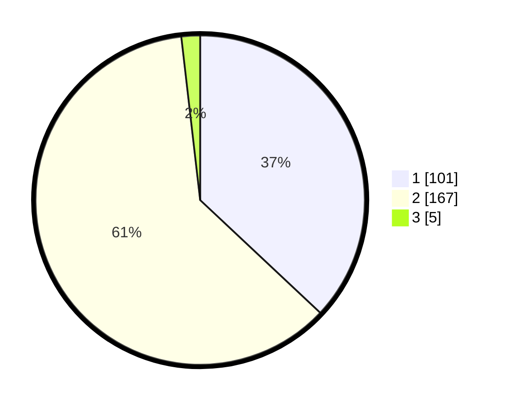

# Hasil

## Grafik

## Tabel

| No. | Nama Paslon    | Suara | Suara (raw) | Persentase |
|:--- |:-------------- | -----:| -----------:| ----------:|
| 1   | ANIES MUHAIMIN | 101   | [101][p-1]  | 37,00      |
| 2   | PRABOWO GIBRAN | 167   | [167][p-2]  | 61,17      |
| 3   | GANJAR MAHFUD  | 5     | [5][p-3]    | 1,83       |

[p-1]: https://github.com/gigit-pemilu/pemilu-2024-36-banten/blob/main/pilpres/hitung-suara/sub/36-banten/sub/74-kota-tangerang-selatan/sub/07-setu/sub/1003-keranggan/sub/018-tps/sub/paslon-1.txt
[p-2]: https://github.com/gigit-pemilu/pemilu-2024-36-banten/blob/main/pilpres/hitung-suara/sub/36-banten/sub/74-kota-tangerang-selatan/sub/07-setu/sub/1003-keranggan/sub/018-tps/sub/paslon-2.txt
[p-3]: https://github.com/gigit-pemilu/pemilu-2024-36-banten/blob/main/pilpres/hitung-suara/sub/36-banten/sub/74-kota-tangerang-selatan/sub/07-setu/sub/1003-keranggan/sub/018-tps/sub/paslon-3.txt

## Foto C Plano

https://sirekap-obj-formc.kpu.go.id/e4c7/pemilu/ppwp/36/74/07/10/03/3674071003018-20240224-211642--0d0f56d3-40e3-4404-b034-830329090278.jpg

https://sirekap-obj-formc.kpu.go.id/e4c7/pemilu/ppwp/36/74/07/10/03/3674071003018-20240224-211725--beaa16f5-a073-4f4d-9dae-67c12594bf40.jpg

https://sirekap-obj-formc.kpu.go.id/e4c7/pemilu/ppwp/36/74/07/10/03/3674071003018-20240224-211828--9df62ace-0c39-427d-80cc-48962271b0fd.jpg

## Metadata

| Key        | Value               |
| ---------- | ------------------- |
| Time Stamp | 2024-02-28 19:00:00 |

