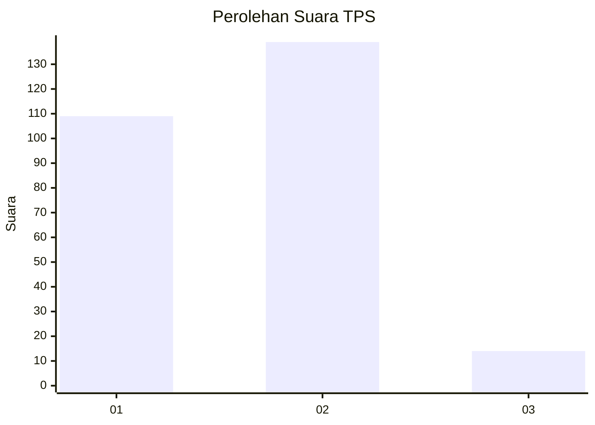
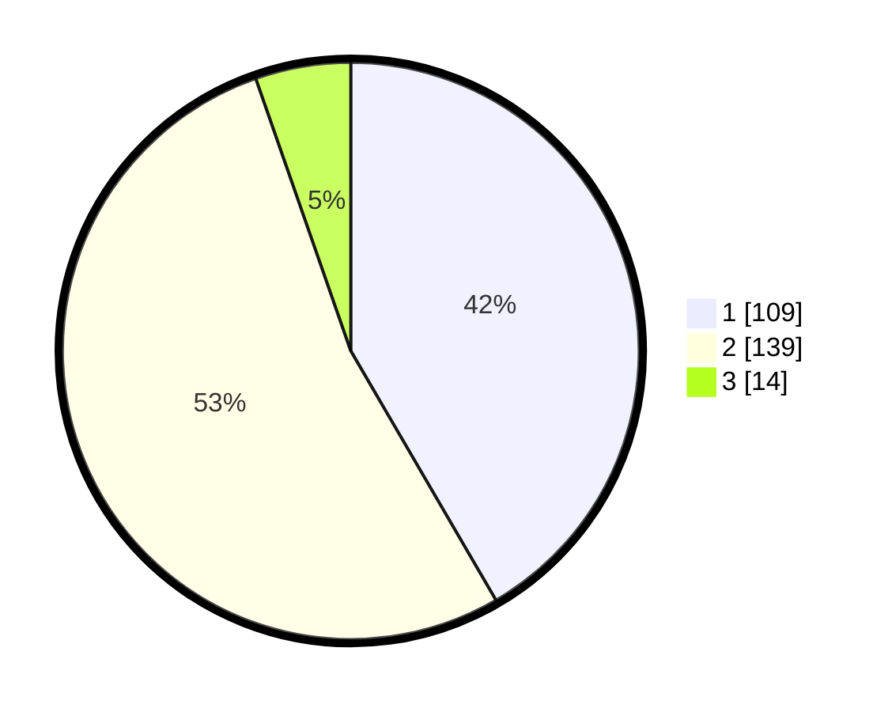

# Hasil

## Grafik

## Tabel

| No. | Nama Paslon    | Suara | Suara (raw) | Persentase |
|:--- |:-------------- | -----:| -----------:| ----------:|
| 1   | ANIES MUHAIMIN | 109   | [109][p-1]  | 41,60      |
| 2   | PRABOWO GIBRAN | 139   | [139][p-2]  | 53,05      |
| 3   | GANJAR MAHFUD  | 14    | [14][p-3]   | 5,34       |

[p-1]: https://github.com/gigit-pemilu/pemilu-2024/blob/main/pilpres/hitung-suara/sub/36-banten/sub/74-kota-tangerang-selatan/sub/07-setu/sub/1004-kademangan/sub/032-tps/sub/paslon-1.txt
[p-2]: https://github.com/gigit-pemilu/pemilu-2024/blob/main/pilpres/hitung-suara/sub/36-banten/sub/74-kota-tangerang-selatan/sub/07-setu/sub/1004-kademangan/sub/032-tps/sub/paslon-2.txt
[p-3]: https://github.com/gigit-pemilu/pemilu-2024/blob/main/pilpres/hitung-suara/sub/36-banten/sub/74-kota-tangerang-selatan/sub/07-setu/sub/1004-kademangan/sub/032-tps/sub/paslon-3.txt

## Foto C Plano

https://sirekap-obj-formc.kpu.go.id/aeee/pemilu/ppwp/36/74/07/10/04/3674071004032-20240215-001209--a57f25d1-e55c-4018-b281-29925b28f94a.jpg

https://sirekap-obj-formc.kpu.go.id/aeee/pemilu/ppwp/36/74/07/10/04/3674071004032-20240215-001302--08d06b72-e82c-42c2-a150-52a1a4c8c1d9.jpg

https://sirekap-obj-formc.kpu.go.id/aeee/pemilu/ppwp/36/74/07/10/04/3674071004032-20240215-001452--a511bb6e-6212-4035-8294-5dca6f25bb64.jpg

## Metadata

| Key        | Value               |
| ---------- | ------------------- |
| Time Stamp | 2024-02-15 18:00:26 |

