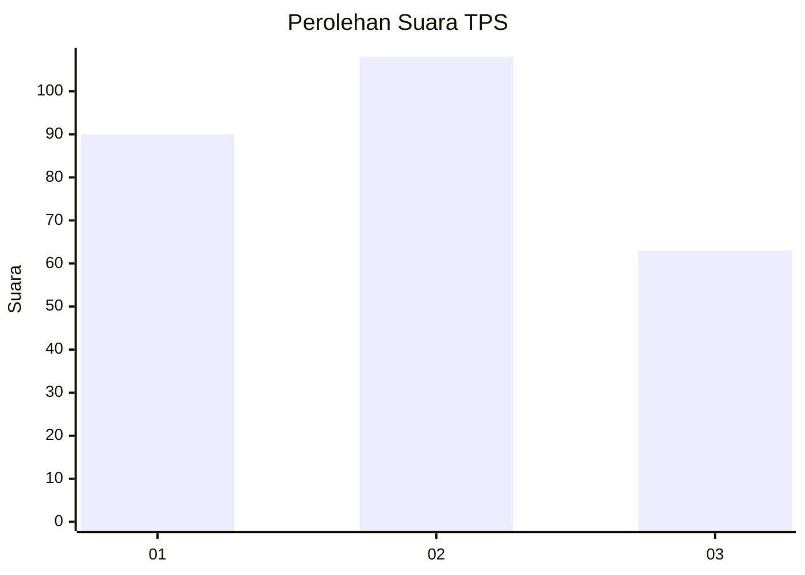
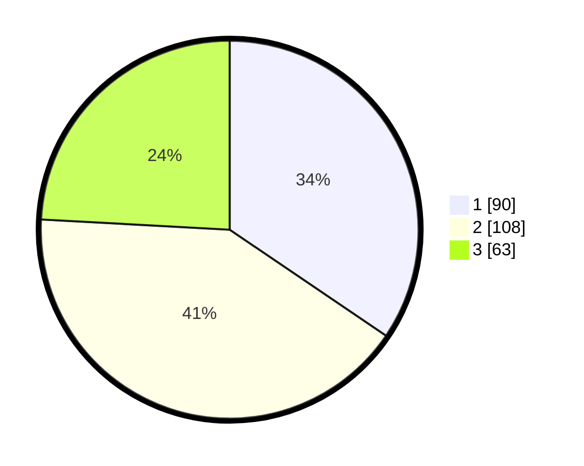

# Hasil

## Grafik

## Tabel

| No. | Nama Paslon    | Suara | Suara (raw) | Persentase |
|:--- |:-------------- | -----:| -----------:| ----------:|
| 1   | ANIES MUHAIMIN | 90    | [90][p-1]   | 34,48      |
| 2   | PRABOWO GIBRAN | 108   | [108][p-2]  | 41,38      |
| 3   | GANJAR MAHFUD  | 63    | [63][p-3]   | 24,14      |

[p-1]: https://github.com/gigit-pemilu/pemilu-2024/blob/main/pilpres/hitung-suara/sub/36-banten/sub/74-kota-tangerang-selatan/sub/07-setu/sub/1005-babakan/sub/032-tps/sub/paslon-1.txt
[p-2]: https://github.com/gigit-pemilu/pemilu-2024/blob/main/pilpres/hitung-suara/sub/36-banten/sub/74-kota-tangerang-selatan/sub/07-setu/sub/1005-babakan/sub/032-tps/sub/paslon-2.txt
[p-3]: https://github.com/gigit-pemilu/pemilu-2024/blob/main/pilpres/hitung-suara/sub/36-banten/sub/74-kota-tangerang-selatan/sub/07-setu/sub/1005-babakan/sub/032-tps/sub/paslon-3.txt

## Foto C Plano

https://sirekap-obj-formc.kpu.go.id/2ffb/pemilu/ppwp/36/74/07/10/05/3674071005032-20240222-163310--f33d8111-6c17-4804-9fee-1165126faa15.jpg

https://sirekap-obj-formc.kpu.go.id/2ffb/pemilu/ppwp/36/74/07/10/05/3674071005032-20240222-163336--f618c496-a267-41eb-b048-4acbe230eda6.jpg

https://sirekap-obj-formc.kpu.go.id/2ffb/pemilu/ppwp/36/74/07/10/05/3674071005032-20240222-163426--724ee024-6d27-447b-90cc-9d85d9004edb.jpg

## Metadata

| Key        | Value               |
| ---------- | ------------------- |
| Time Stamp | 2024-02-25 18:00:00 |

