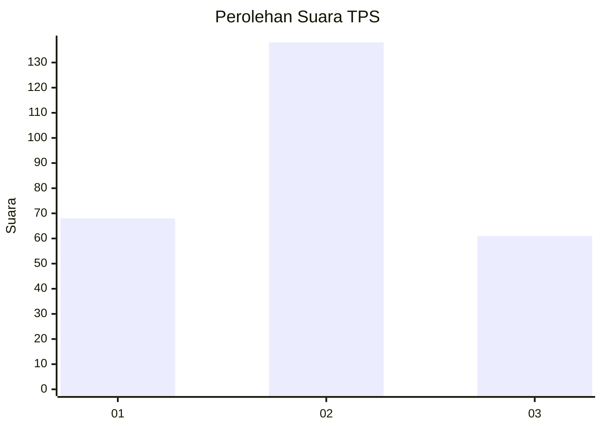
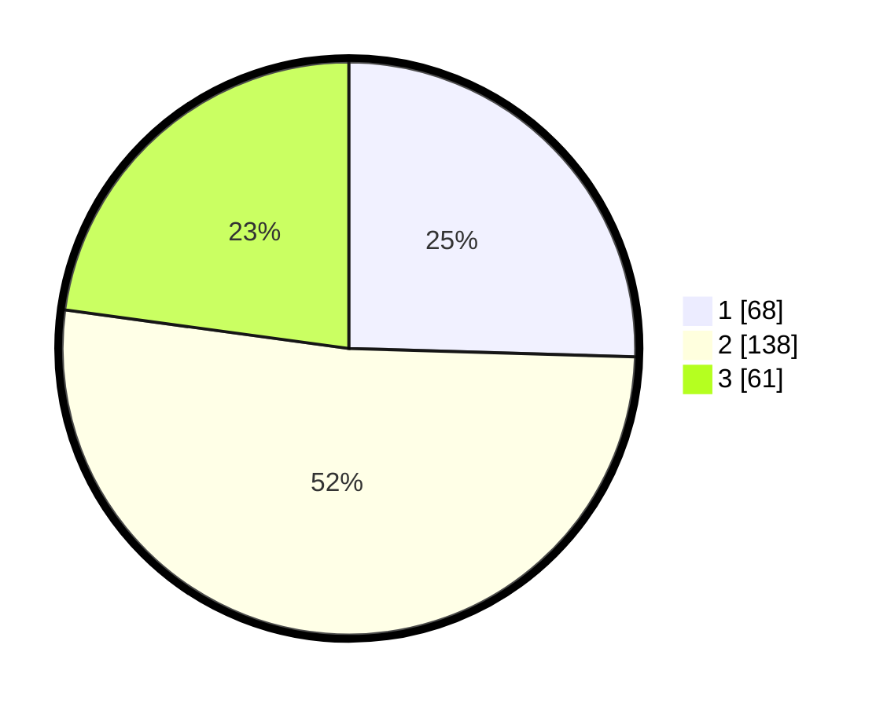

# Hasil

## Grafik

## Tabel

| No. | Nama Paslon    | Suara | Suara (raw) | Persentase |
|:--- |:-------------- | -----:| -----------:| ----------:|
| 1   | ANIES MUHAIMIN | 68    | [68][p-1]   | 25,47      |
| 2   | PRABOWO GIBRAN | 138   | [138][p-2]  | 51,69      |
| 3   | GANJAR MAHFUD  | 61    | [61][p-3]   | 22,85      |

[p-1]: https://github.com/gigit-pemilu/pemilu-2024-36-banten/blob/main/pilpres/hitung-suara/sub/36-banten/sub/74-kota-tangerang-selatan/sub/07-setu/sub/1005-babakan/sub/034-tps/sub/paslon-1.txt
[p-2]: https://github.com/gigit-pemilu/pemilu-2024-36-banten/blob/main/pilpres/hitung-suara/sub/36-banten/sub/74-kota-tangerang-selatan/sub/07-setu/sub/1005-babakan/sub/034-tps/sub/paslon-2.txt
[p-3]: https://github.com/gigit-pemilu/pemilu-2024-36-banten/blob/main/pilpres/hitung-suara/sub/36-banten/sub/74-kota-tangerang-selatan/sub/07-setu/sub/1005-babakan/sub/034-tps/sub/paslon-3.txt

## Foto C Plano

https://sirekap-obj-formc.kpu.go.id/8773/pemilu/ppwp/36/74/07/10/05/3674071005034-20240215-024529--3faf41bf-90c9-4a8a-9618-464f8cbe84ea.jpg

https://sirekap-obj-formc.kpu.go.id/8773/pemilu/ppwp/36/74/07/10/05/3674071005034-20240215-024705--9ab9afe0-a429-4039-8e6c-0eb47afc38ef.jpg

https://sirekap-obj-formc.kpu.go.id/8773/pemilu/ppwp/36/74/07/10/05/3674071005034-20240215-024819--079bfdf4-334d-4c39-8bb0-6d2f4b35f4b4.jpg

## Metadata

| Key        | Value               |
| ---------- | ------------------- |
| Time Stamp | 2024-02-17 13:37:34 |

