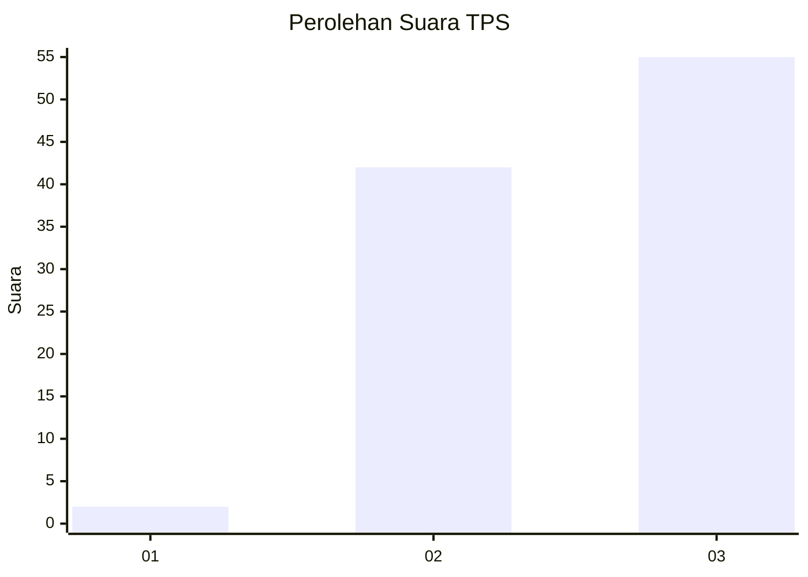
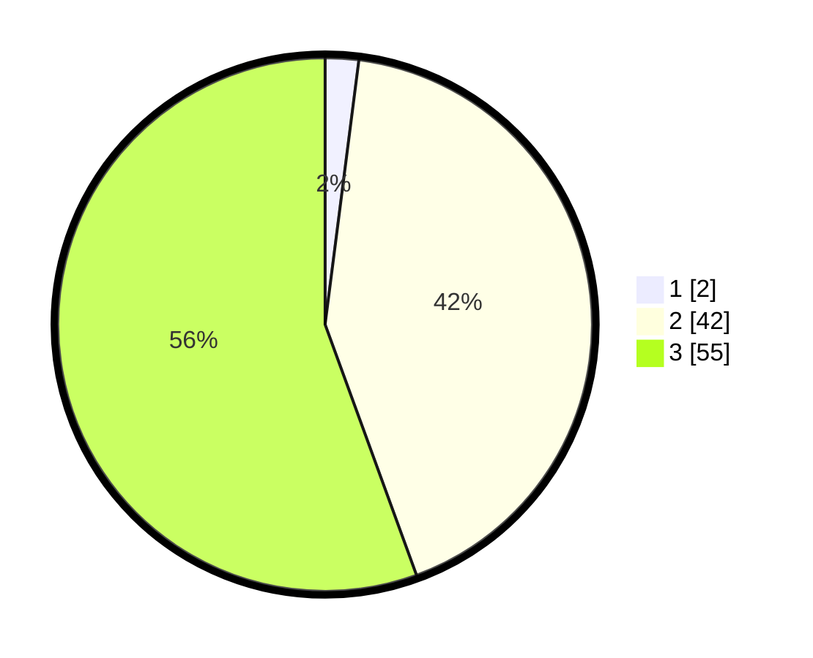

# Hasil

## Grafik

## Tabel

| No. | Nama Paslon    | Suara | Suara (raw) | Persentase |
|:--- |:-------------- | -----:| -----------:| ----------:|
| 1   | ANIES MUHAIMIN | 2     | [2][p-1]    | 2,02       |
| 2   | PRABOWO GIBRAN | 42    | [42][p-2]   | 42,42      |
| 3   | GANJAR MAHFUD  | 55    | [55][p-3]   | 55,56      |

[p-1]: https://github.com/gigit-pemilu/pemilu-2024/blob/main/pilpres/hitung-suara/sub/36-banten/sub/74-kota-tangerang-selatan/sub/07-setu/sub/1005-babakan/sub/901-tps/sub/paslon-1.txt
[p-2]: https://github.com/gigit-pemilu/pemilu-2024/blob/main/pilpres/hitung-suara/sub/36-banten/sub/74-kota-tangerang-selatan/sub/07-setu/sub/1005-babakan/sub/901-tps/sub/paslon-2.txt
[p-3]: https://github.com/gigit-pemilu/pemilu-2024/blob/main/pilpres/hitung-suara/sub/36-banten/sub/74-kota-tangerang-selatan/sub/07-setu/sub/1005-babakan/sub/901-tps/sub/paslon-3.txt

## Foto C Plano

https://sirekap-obj-formc.kpu.go.id/5241/pemilu/ppwp/36/74/07/10/05/3674071005901-20240222-213546--a7c4a91d-732c-4b6a-bff8-f39da8cb6203.jpg

https://sirekap-obj-formc.kpu.go.id/5241/pemilu/ppwp/36/74/07/10/05/3674071005901-20240222-213613--d3647361-4d08-47e7-a494-160bced26786.jpg

https://sirekap-obj-formc.kpu.go.id/5241/pemilu/ppwp/36/74/07/10/05/3674071005901-20240222-213658--d86fdfaa-f4a6-4705-8501-0205aae00da1.jpg

## Metadata

| Key        | Value               |
| ---------- | ------------------- |
| Time Stamp | 2024-02-24 22:31:28 |

